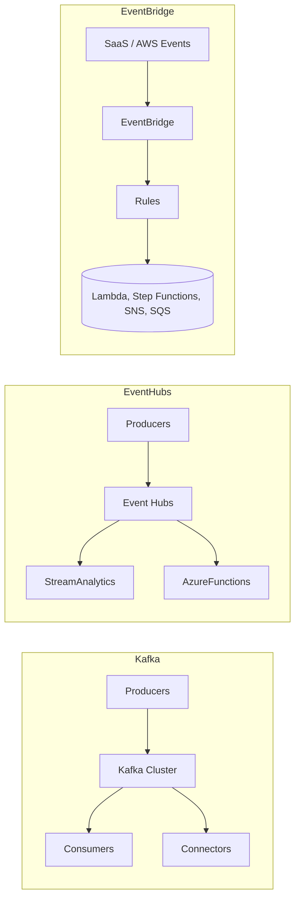

# Kafka vs AWS EventBridge vs Azure Event Hubs

Summary

- **Kafka:** Distributed, partitioned commit-log. High throughput, low latency, replayable, strong ordering per partition. Best for stream processing, event sourcing, change-data-capture (CDC), and systems that need consumer control and replay.
- **AWS EventBridge:** Serverless event bus with rich routing rules and SaaS/AWS integrations. Best for application integration, cross-account/service routing, and simple event-driven automation without managing brokers.
- **Azure Event Hubs:** Managed high-throughput ingestion platform with partitioning and retention; supports Kafka protocol compatibility. Best for telemetry ingestion, analytics pipelines, and streaming into Azure stream processors.

Architectural differences

- Persistence & Replay:
  - Kafka / Event Hubs: durable, configurable retention; consumers can replay.
  - EventBridge: shorter retention, not designed for large-scale replay.
- Protocol & Ecosystem:
  - Kafka: native Kafka protocol, rich ecosystem (Kafka Streams, Connectors, ksqlDB).
  - Event Hubs: native API + Kafka protocol endpoint in Azure.
  - EventBridge: AWS event format, rule-driven routing, direct SaaS integrations.
- Throughput & Latency:
  - Kafka & Event Hubs: optimized for very high throughput and low latency.
  - EventBridge: designed for integration, lower throughput ceiling for heavy streaming.

When to choose

- Kafka when:
  - You require durable event log and consumer replay.
  - You need strong ordering/per-partition and stream processing.
  - You accept operational overhead or use managed Kafka (MSK/Confluent).
- EventBridge when:
  - You want low operational overhead and many AWS/SaaS integrations.
  - You need rule-based routing and serverless event-driven architecture.
- Event Hubs when:
  - You are on Azure and need managed high-throughput ingestion with Kafka compatibility.

Mermaid diagram

Decision checklist

- Need replay + high throughput → Kafka / Event Hubs
- Need SaaS/AWS routing and serverless integration → EventBridge
- Need managed Kafka protocol on cloud → Event Hubs (or MSK with Kafka)

---
