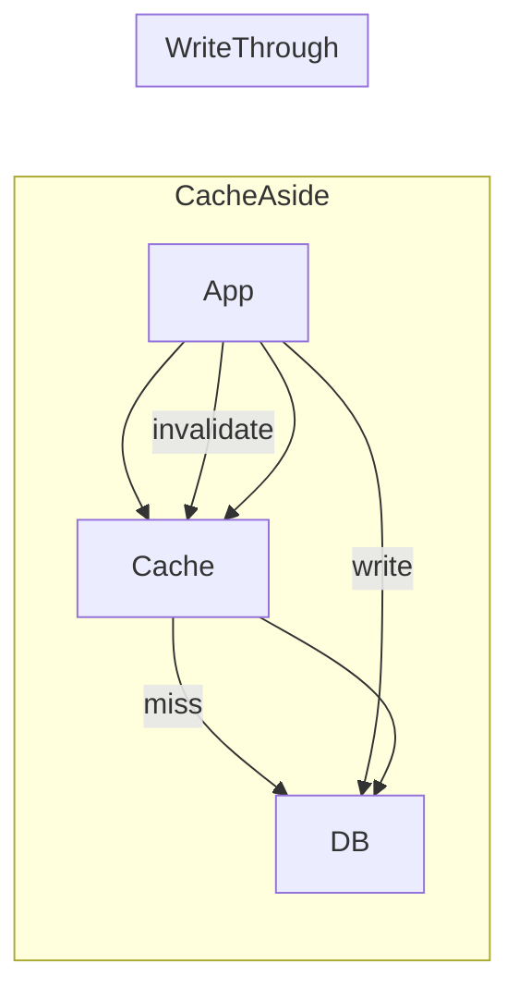

# Redis Write Options — Patterns & Trade-offs

Common write patterns

- **Cache-Aside (Lazy Loading)**
  - Read: app checks cache, on miss read DB and populate cache.
  - Write: update DB then invalidate or update cache.
  - Pros: simple and safe; DB is the source of truth.
- **Write-Through**
  - App writes to cache synchronously; cache writes through to DB.
  - Pros: cache consistency; Cons: higher write latency.
- **Write-Behind / Write-Back**
  - App writes to cache; cache asynchronously persists to DB.
  - Pros: low write latency; Cons: risk of data loss if cache fails before flush.

Redis durability & concurrency features

- **Persistence modes**
  - RDB snapshots: periodic snapshots (fast restore, potential data loss since last snapshot).
  - AOF (Append Only File): write-ahead log; configurable fsync policies (always/everysec/no).
- **Replication & HA**
  - Master-replica for read scaling; replicas are asynchronous by default.
  - Sentinel or Cluster for failover and sharding.
- **Atomic operations**
  - Lua scripts (`EVAL`) for server-side atomic sequences.
  - `MULTI/EXEC` and `WATCH` for optimistic transactions.

Decision notes

- Low-latency writes and tolerable data-loss → write-behind with proper persistence configured.
- Strong durability guarantees → write-through or DB-first cache-aside with AOF and fsync tuning.
- Use Redis Cluster for horizontal sharding and Lua scripts for atomic cross-key updates.

Mermaid diagram

---
