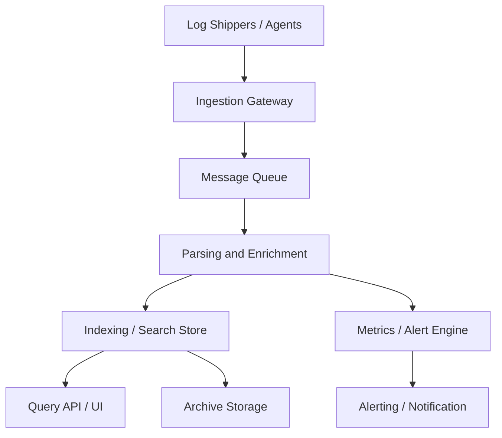

# Centralized Logging System Design

## Overview

Design a centralized logging system that collects, stores, indexes, and analyzes logs from distributed services and infrastructure. The system should support real-time ingestion, searchable log queries, alerting, and long-term storage.

## Goals

- Centralize logs from application servers, microservices, load balancers, and background jobs.
- Provide low-latency ingestion and query for operational troubleshooting.
- Support structured and unstructured logs.
- Enable alerting and dashboards for key metrics and anomalies.
- Ensure durability, scalability, and access control.

## Requirements

### Functional

- Ingest logs from many sources in real time.
- Parse and normalize log metadata (timestamp, service, level, request ID).
- Store logs in an index for fast full-text search and filtering.
- Expose query APIs for ad hoc searches, saved queries, and dashboards.
- Support alerting rules based on log frequency, error rates, or patterns.
- Archive or tier old logs to cheaper storage.

### Non-functional

- High availability and fault tolerance.
- Low write latency and reasonable query performance.
- Elastic scalability across ingestion, storage, and query.
- Secure access control and audit logging.
- Efficient storage for high log volume (terabytes per day).

## High-level Components

1. Log shippers / agents
2. Ingestion gateway
3. Message queue
4. Parsing and enrichment pipeline
5. Indexing and storage
6. Query and search service
7. Alerting engine
8. Long-term archive
9. Access control and UI

## Architecture

### Architecture Diagram

### 1. Log Shippers

- Install lightweight agents on hosts or use sidecar containers.
- Forward logs over HTTP, gRPC, or syslog to the ingestion gateway.
- Support backpressure and batching.

### 2. Ingestion Gateway

- Accept log events from many producers.
- Perform initial validation and authentication.
- Buffer events into a durable message queue (e.g. Kafka, Pulsar).

### 3. Message Queue

- Decouple producers from consumers.
- Ensure durability and replay support.
- Partition by source, service, or region.

### 4. Parsing and Enrichment

- Parse logs into structured fields using regex, JSON parsers, or multiline support.
- Enrich with metadata: service name, environment, hostname, request ID, trace ID.
- Tag logs with severity, customer ID, or region.

### 5. Indexing and Storage

- Use a search index like Elasticsearch, OpenSearch, or ClickHouse for fast queries.
- Store full log text and indexed fields.
- Support time-based indices and rollovers.

### 6. Query and Search Service

- Provide APIs for keyword search, filtering, aggregations, and time range queries.
- Offer UI dashboards and saved search templates.
- Support pagination and result streaming.

### 7. Alerting Engine

- Evaluate alert rules against streaming log data or aggregated metrics.
- Trigger notifications via email, Slack, SMS, or PagerDuty.
- Support threshold, rate, and anomaly-based alerts.

### 8. Archive Storage

- Move older logs to cheaper object storage such as S3 or GCS.
- Keep indexes for recent logs and archived raw logs for compliance.
- Provide retrieval APIs for archived data when necessary.

## Data Flow

1. Applications emit logs to local shippers.
2. Shippers forward logs to the ingestion gateway.
3. The gateway writes events to a durable queue.
4. Processing workers parse, enrich, and index logs.
5. The search service executes user queries.
6. The alerting engine monitors log patterns and generates notifications.
7. Old logs are archived to long-term storage.

## Data Model

### Log Event

- `log_id`
- `timestamp`
- `service`
- `environment`
- `severity`
- `message`
- `host`
- `pod_id`
- `request_id`
- `trace_id`
- `tags`
- `raw_payload`

### Alert Rule

- `rule_id`
- `query`
- `threshold`
- `window`
- `severity`
- `notifications`
- `enabled`

## Scalability Considerations

- Partition ingestion by service, region, or tenant.
- Scale consumers horizontally to keep up with queue throughput.
- Use time-based indices and retention policies.
- Cache frequent queries and dashboards.
- Compress logs and store only indexed fields for recent retention.

## Reliability and Durability

- Replicate queue and storage across availability zones.
- Use write-ahead logs and retries for ingestion.
- Provide backfill from the queue if processing fails.
- Automatically recover from node failures.
- Monitor ingestion latency, queue lag, and query errors.

## Security and Access Control

- Authenticate producers and consumers.
- Authorize queries and dashboard access by role.
- Encrypt data in transit and at rest.
- Audit user access and changes to alert rules.

## Interview Talking Points

- Clarify whether logs are from a single service or many microservices.
- Ask about retention policies and compliance requirements.
- Discuss real-time alerting versus batch analysis.
- Explain trade-offs between index speed, storage cost, and query latency.
- Mention how to handle bursty log traffic and backpressure.

## Extensions

- Add distributed tracing integration for correlating logs with traces.
- Support metrics and events alongside logs in a unified observability platform.
- Add anomaly detection with machine learning on log volumes.
