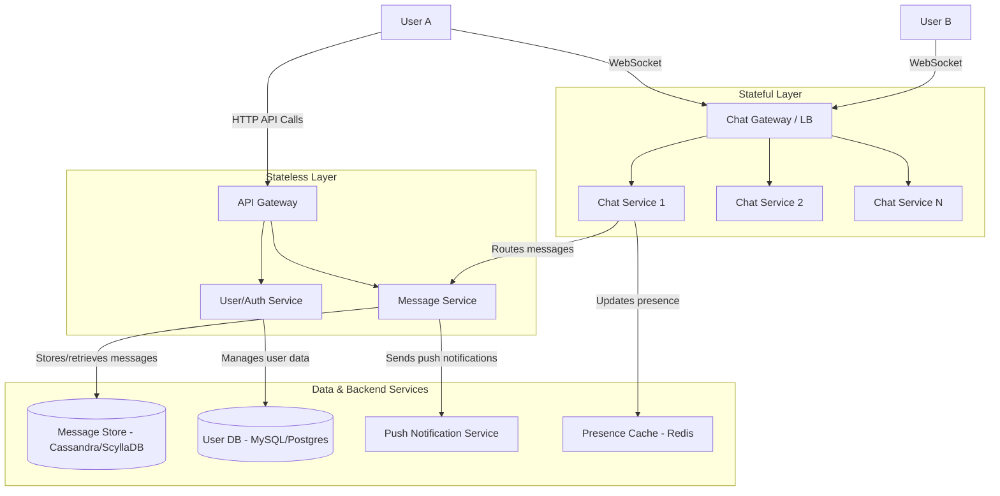
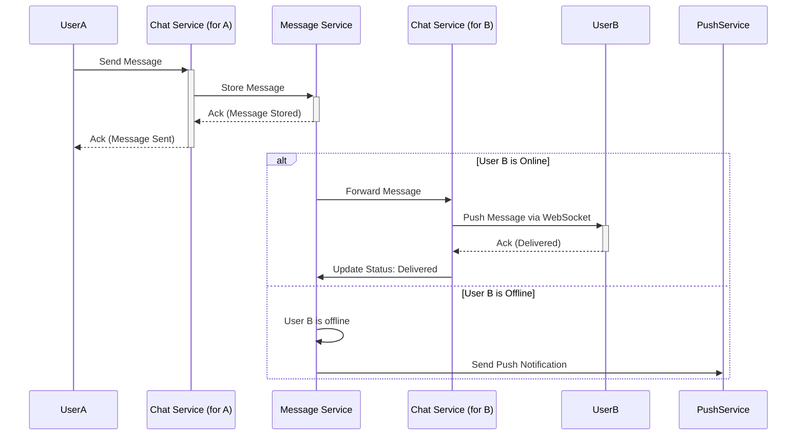

# System Design: Chat Application (WhatsApp/Slack)

## 1. Overview

This document outlines the design for a scalable chat application supporting one-on-one and group messaging, online presence indicators, and read receipts. The core challenges are managing persistent connections at scale, ensuring reliable and low-latency message delivery, and handling fan-out for group chats.

## 2. Requirements & Goals

### Functional Requirements
1.  **One-on-One Chat**: Users can send and receive messages in a private conversation.
2.  **Group Chat**: Users can send and receive messages in a group with multiple members.
3.  **Online Presence**: Users can see the online/offline status of their contacts.
4.  **Read Receipts**: Users can see if their message has been delivered and read.
5.  **Push Notifications**: Offline users receive notifications for new messages.

### Non-Functional Requirements
1.  **Low Latency**: Messages should be delivered in near real-time (<200ms).
2.  **High Availability**: The service must be resilient to node failures.
3.  **Scalability**: Support millions of concurrent users and billions of messages per day.
4.  **Durability & Reliability**: Messages should not be lost, even if a user is offline.
5.  **Consistency**: Messages within a single chat should be strictly ordered.

### Capacity Estimation
-   **Users**: 500 million Daily Active Users (DAU).
-   **Concurrent Connections**: Assume 20% are online at peak = 100 million concurrent connections.
-   **Messages**: 50 messages/user/day = 25 billion messages/day.
    -   ~290,000 messages/sec on average. Peak traffic could be 2-3x, so plan for ~1M messages/sec.
-   **Storage**: Assume average message size is 200 bytes.
    -   `25B messages/day * 200 bytes/msg * 365 days * 5 years` = ~9 PB over 5 years. This requires a scalable, distributed database.

## 3. High-Level Architecture

The system consists of stateless API services for login/user management and stateful Chat Services for managing real-time connections.

!Chat Application High-Level Architecture

## 4. Low-Level Design

### A. Connection Management

To support real-time, bidirectional communication, **WebSockets** are the ideal choice. They provide a persistent, low-overhead connection between the client and a server.

-   **Chat Gateway**: A load balancer that routes WebSocket connections. It needs to be intelligent enough to route a user's connection consistently to the same Chat Service instance where their session is managed. This can be done via a lookup service (e.g., Redis mapping `user_id` to `chat_server_ip`).
-   **Chat Service**: A stateful service that maintains active WebSocket connections for a subset of users. It receives messages from clients, forwards them, and tracks presence.
-   **Fallback**: For clients behind restrictive firewalls, **Long Polling** can be used as a fallback mechanism.

### B. Message Flow: One-on-One Chat

!1-on-1 Chat Sequence Diagram

### C. Message Flow: Group Chat

Group chat requires a "fan-out on write" approach.

1.  User sends a message to a group.
2.  The Chat Service receives it and forwards it to the Message Service.
3.  The Message Service stores the message in the database.
4.  It then fetches the list of all members in the group.
5.  For each member, it checks their online status:
    -   **Online**: Forwards the message to the appropriate Chat Service, which pushes it to the user's WebSocket.
    -   **Offline**: Triggers a push notification.

This fan-out can be done asynchronously via a message queue (like Kafka) to avoid blocking the sender.

### D. Presence Detection

-   When a client connects via WebSocket, the Chat Service marks the user as `online` in a distributed cache (Redis) with a TTL.
-   The client sends a periodic heartbeat (e.g., every 30 seconds) to keep the session alive and refresh the TTL.
-   When the WebSocket disconnects, the Chat Service marks the user as `offline`.
-   To view a contact's status, the client subscribes to presence updates for that contact. The Chat Service pushes status changes only to interested subscribers to avoid broadcasting to everyone.

## 5. Data Model

A wide-column NoSQL database like **Cassandra** or **ScyllaDB** is ideal for the message store due to its high write throughput and linear scalability.

**Messages Table**
-   **Primary Key**: `(conversation_id, message_id)`
    -   `conversation_id`: A unique ID for the 1-on-1 or group chat.
    -   `message_id`: A time-based, sortable ID (like a Snowflake ID or a TimeUUID) to ensure chronological order.
-   **Columns**: `sender_id`, `content`, `created_at`, `metadata`.

**Why Cassandra/ScyllaDB?**
-   **Write-Heavy Workload**: Chat is extremely write-heavy. These databases are optimized for high write throughput.
-   **Scalability**: Can scale horizontally by adding more nodes.
-   **Partitioning**: Partitioning by `conversation_id` keeps all messages for a single chat on one replica set, making reads for a chat history very fast.

**User/Group Metadata**
-   A relational database (Postgres/MySQL) can be used for user accounts, contact lists, and group memberships, as this data has relational integrity and lower write volume.

## 6. Scalability and Reliability

-   **Chat Services**: These are stateful. If a node fails, all WebSocket connections it holds are dropped. Clients must automatically reconnect. The Chat Gateway, with help from a service discovery mechanism, will route them to a healthy node.
-   **Message Services**: These are stateless and can be scaled horizontally.
-   **Database**: Cassandra/ScyllaDB scales horizontally. Sharding the relational DB by `user_id` or `group_id` can handle metadata scaling.
-   **Message Ordering**: Using a time-sortable `message_id` (like a Snowflake ID) within a `conversation_id` partition key guarantees message order within a chat.

## 7. Interview Talking Points

-   **Stateful vs. Stateless**: Clearly distinguish between the stateful connection-managing layer (Chat Services) and the stateless business logic layer (Message/User Services).
-   **Connection Technology**: Justify WebSockets over Long Polling (lower overhead, truly bidirectional) and explain the fallback strategy.
-   **Database Choice**: Argue for a wide-column store like Cassandra for the message store due to the write-heavy nature and access patterns (querying by conversation).
-   **Fan-out Strategy**: Explain the "fan-out on write" approach for group messages and how a message queue can make this process asynchronous and more resilient.
-   **Presence Scaling**: Discuss the challenge of presence updates (can be a huge write load) and the optimization of only pushing updates to interested clients.