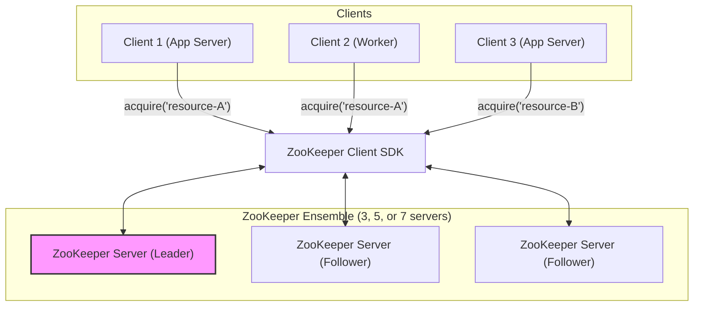

# Distributed Lock Manager using ZooKeeper

## 1. Overview

In a distributed system, multiple processes running on different machines often need to coordinate access to a shared resource. Without a coordination mechanism, this can lead to race conditions, data corruption, and inconsistent state. A distributed lock manager provides a mutual exclusion primitive, ensuring that only one process can access a critical section or resource at any given time.

This document describes the design of a distributed lock manager using **Apache ZooKeeper**. ZooKeeper is a centralized coordination service that is highly reliable and provides a simple set of primitives (Znodes and watches) that are perfectly suited for implementing distributed locks.

## 2. Requirements

### Functional Requirements

- **Mutual Exclusion**: At any moment, only one client can hold the lock for a specific resource.
- **Acquire Lock**: Provide a mechanism for a client to request and obtain a lock. The call should block until the lock is acquired.
- **Release Lock**: Provide a mechanism for a client to release a lock it holds.

### Non-Functional Requirements

- **High Availability**: The lock service must remain operational even if some of its nodes fail.
- **Fault Tolerance (No Deadlocks)**: If a client holding a lock crashes or becomes disconnected, the lock must be automatically released to prevent deadlocks.
- **Performance**: Lock acquisition and release operations should be fast and have low overhead.
- **Fairness**: Locks should generally be granted in the order they were requested (First-In, First-Out).

## 3. High-Level Architecture

The architecture is straightforward, consisting of clients that use a ZooKeeper SDK to interact with a ZooKeeper server cluster (called an ensemble).




### Components

- **ZooKeeper Ensemble**: A cluster of ZooKeeper servers that maintains the lock state. It provides strong consistency and fault tolerance through the ZAB consensus protocol. An odd number of servers (e.g., 3, 5) is used to tolerate failures while maintaining a quorum.
- **ZooKeeper Client SDK**: A library within the client application (e.g., Apache Curator, Kazoo) that implements the lock recipe. It handles the communication with the ZooKeeper ensemble, including creating Znodes and setting watches.

## 4. Low-Level Design: The Lock Recipe

The core of the design is the specific algorithm (or "recipe") used to implement the lock using ZooKeeper's primitives. This recipe relies on **ephemeral-sequential Znodes**.

- **Ephemeral Znodes**: These are automatically deleted by ZooKeeper when the client session that created them ends (either by a clean disconnect or a timeout). This elegantly solves the problem of a client crashing while holding a lock.
- **Sequential Znodes**: When creating a Znode with the sequential flag, ZooKeeper appends a monotonically increasing 10-digit sequence number to the path. This provides a natural ordering for lock requests.

### Lock Acquisition Flow

The following sequence diagram illustrates how a client acquires a lock for a resource named `my-resource`.

!ZooKeeper Lock Acquisition Flow

```mermaid
sequenceDiagram
    participant Client
    participant ZK as ZooKeeper Ensemble

    Client->>+ZK: Create Ephemeral-Sequential Znode at `/locks/my-resource/lock-`
    ZK-->>-Client: Znode created: `/locks/my-resource/lock-0000000005`

    Client->>+ZK: Get Children of `/locks/my-resource`
    ZK-->>-Client: Return list: `[lock-0000000003, lock-0000000005]`

    alt My Znode is the lowest
        Client->>Client: Acquire Lock!
    else My Znode is NOT the lowest
        Client->>Client: Find preceding Znode (`lock-0000000003`)
        Client->>+ZK: Set Watch on `/locks/my-resource/lock-0000000003`
        ZK-->>-Client: Watch set
        Client->>Client: Wait for notification...
    end

    Note over ZK: Preceding lock is released (client disconnects or calls release).
    ZK-->>Client: Notification: `/locks/my-resource/lock-0000000003` deleted.

    Client->>+ZK: Get Children of `/locks/my-resource`
    ZK-->>-Client: Return list: `[lock-0000000005]`
    Client->>Client: My Znode is now lowest. Acquire Lock!
end
```

**Detailed Steps to Acquire Lock:**
1.  A client wishing to acquire a lock for a resource `R` first creates a persistent parent Znode `/locks/R` if it doesn't already exist.
2.  The client attempts to create an **ephemeral-sequential** Znode at the path `/locks/R/lock-`. ZooKeeper will create a Znode with a unique, sequential path, e.g., `/locks/R/lock-0000000005`.
3.  The client then gets the list of all children of `/locks/R`.
4.  The client checks if the Znode it just created has the **lowest sequence number** among all children.
5.  **If it is the lowest**, the client has successfully acquired the lock and can proceed with its critical section.
6.  **If it is not the lowest**, the client has not acquired the lock. To avoid a "thundering herd" of all clients polling, it finds the child Znode with the sequence number immediately preceding its own.
7.  The client sets a **watch** on this preceding Znode. The watch will trigger a notification if that Znode is deleted.
8.  The client waits. When the preceding lock is released (or the client holding it crashes), its ephemeral Znode is deleted, and our client receives the notification.
9.  Upon notification, the client goes back to step 3 and re-checks the list of children. It repeats this process until it acquires the lock.

### Lock Release Flow

Releasing a lock is very simple:

1.  The client **deletes the ephemeral-sequential Znode** it created during the acquisition process.

That's it. The deletion of this Znode will trigger the watch for the next client waiting in the queue, allowing it to attempt to acquire the lock. If the client crashes, ZooKeeper's session timeout mechanism will automatically delete the ephemeral Znode, ensuring the lock is eventually released.

## 5. Code Example (Python with Kazoo)

The `kazoo` library provides a high-level implementation of this recipe.

```python
from kazoo.client import KazooClient
import time
import os

# Connect to ZooKeeper
zk = KazooClient(hosts='127.0.0.1:2181')
zk.start()

# Create a lock object for a specific resource path
lock_path = "/locks/my-shared-resource"
lock = zk.Lock(lock_path, f"client-{os.getpid()}")

print(f"Client {os.getpid()} attempting to acquire lock...")

try:
    # This is a blocking call that implements the recipe described above
    with lock:
        print(f"Client {os.getpid()} has acquired the lock!")
        
        # --- Critical Section ---
        print("Performing work on the shared resource...")
        time.sleep(10) # Simulate work
        print("Work finished.")
        # --- End Critical Section ---

    # The lock is automatically released when exiting the 'with' block
    print(f"Client {os.getpid()} has released the lock.")

except Exception as e:
    print(f"An error occurred: {e}")

finally:
    # Clean up the connection
    zk.stop()
    zk.close()
```

## 6. Scalability and Reliability

- **Scalability**: Read operations in ZooKeeper scale horizontally by adding more followers. Since the lock recipe involves reads (getting children), it scales well. Write performance (creating/deleting Znodes) is limited by the leader but is generally fast enough for this use case. The main bottleneck would be a very high rate of lock contention on a single resource.
- **Reliability**: ZooKeeper is designed for high availability. An ensemble of `2f + 1` servers can tolerate `f` server failures. As long as a majority of servers (a quorum) is up, the service remains available.
- **Fault Tolerance**: The use of ephemeral Znodes provides automatic cleanup and prevents deadlocks, which is a major reliability win.

## 7. Trade-offs and Alternatives

### Advantages of using ZooKeeper

- **Correctness**: Provides strong consistency guarantees, making it easier to build a correct lock manager.
- **Reliability**: Automatic lock release on client failure is a built-in feature.
- **Fairness**: The sequential node recipe provides a fair, queue-based locking mechanism.
- **Thundering Herd Avoidance**: The watch-on-preceding-node pattern is highly efficient.

### Disadvantages

- **Operational Complexity**: Running and maintaining a ZooKeeper cluster requires expertise.
- **Performance**: While fast, it may not be as fast as in-memory solutions like Redis for uncontended locks, as it involves disk writes for durability.
- **"Heavy" Dependency**: Pulling in ZooKeeper just for distributed locking might be overkill if it's not already used in the system.

### Alternatives

- **Redis**: Can be used to implement distributed locks using the `SET key value NX PX timeout` command (Redlock algorithm). It's often faster but has weaker consistency guarantees and requires careful implementation to handle client failures correctly.
- **Database**: A row in a database table can be used as a lock. This is simple to implement but can be slow, not very scalable, and requires a robust mechanism to handle lock timeouts for crashed clients.
- **Consul**: Another coordination service similar to ZooKeeper that also provides a native distributed lock API.

## 8. Interview Talking Points

- Start by defining the requirements for a distributed lock: mutual exclusion and deadlock prevention.
- Explain why ephemeral and sequential Znodes are the key primitives that make ZooKeeper a great fit.
- Clearly describe the lock acquisition algorithm, especially how watches are used to avoid the "thundering herd" problem. This demonstrates a deep understanding.
- Discuss the automatic lock release mechanism on client failure as a key benefit.
- Be prepared to compare the ZooKeeper approach with alternatives like Redis (Redlock), highlighting the trade-offs between consistency, performance, and operational complexity.