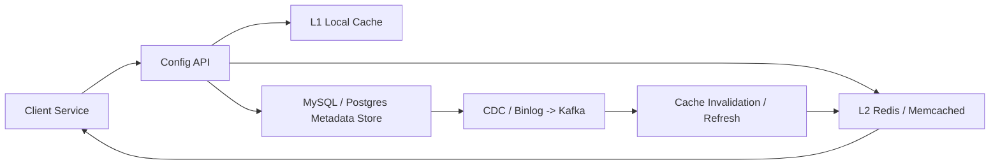
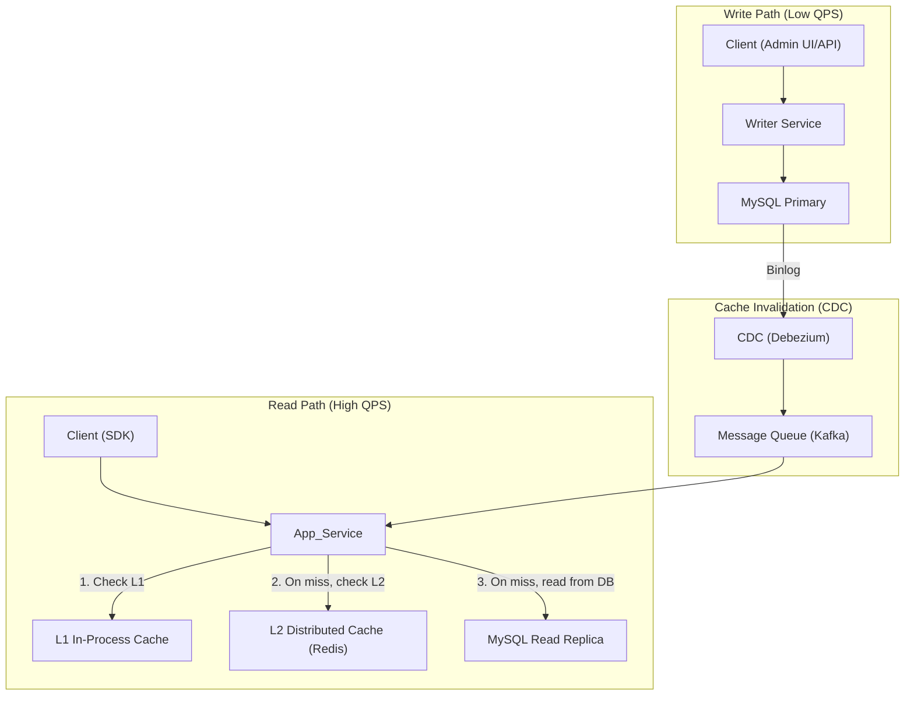

# Dynamic Configuration Service Design

This design document describes a scalable configuration/feature-flag service that supports:

- 10,000 → 100,000 read QPS
- 1 → 100 write QPS
- Low-latency reads for distributed clients
- Cache consistency with infrequent updates
- Support for large payloads up to 500 KB

## Visualization




## Requirements

### Functional

- Read configuration by key
- Update configuration values
- Ensure clients see fresh configuration soon after writes

### Non-functional

- 100K read QPS with low latency
- 100 write QPS
- High availability
- Strong operational simplicity for cache invalidation
- Efficient handling of large payloads

## Why this database?

We choose MySQL for metadata and transactionally consistent updates because:

- Writes are low volume (1–100 QPS), so a relational primary works well.
- Config metadata is small and structured: keys, versions, pointers, TTLs.
- MySQL provides ACID writes, easy version bumping, and stable CDC support.
- Binlog-based CDC is mature and integrates well with Debezium / Kafka.
- It is easier to reason about correctness for config updates than a purely eventually consistent store.

### Alternative datastore options

- PostgreSQL: equivalent alternative with the same benefits.
- Cloud relational DBs: Amazon Aurora, Cloud SQL, Azure Database.
- NoSQL key-value stores: DynamoDB, Cassandra, ScyllaDB.
  - Stronger horizontal scale for writes/reads, but weaker transactional semantics.
  - Good if you want simpler key-value access and global distribution.
- Distributed cache as primary store: Redis Cluster, Aerospike.
  - Useful for ultra-low-latency reads if you can accept in-memory persistence or replication tradeoffs.
- Document stores: MongoDB, Couchbase.
  - Useful if config payloads are large JSON documents and schema is flexible.
- Object storage + metadata DB: S3/GCS for payloads, MySQL/Postgres for metadata.
  - Best for 500 KB+ payloads where the DB should not carry the full blob.

## High-level architecture

A cache-first architecture is required to avoid touching MySQL at 100K QPS.

Components:

- API Gateway / Load Balancer
- Application service instances
- L1 local in-process cache
- L2 distributed cache (Redis / Memcached)
- MySQL primary + read replicas
- CDC stream (Debezium / Kafka / PubSub)
- Optional object storage / CDN for heavy payloads

Diagram:




## Cache architecture and invalidation options

### Cache-Aside

Read flow:
1. Application checks L1 local cache.
2. If miss, it checks L2 distributed cache.
3. If still miss, it reads from MySQL read replica.
4. It populates L2 and L1 on the return path.

Write flow:
1. Update DB.
2. Invalidate cache entries.
3. Serve subsequent reads from the new value.

Pros:
- Simple and widely used.
- Cache only contains data that is actually read.
- Works well for read-heavy workloads.

Cons:
- Cache misses cost an extra round trip.
- Requires a reliable invalidation mechanism.

### Write-Through

Write flow:
1. Application writes to cache.
2. Cache writes through to DB synchronously.

Pros:
- Cache is immediately fresh.
- Reads see the latest value if they hit cache.

Cons:
- Higher write latency.
- More complex to handle cache failure and DB fallback.
- Not ideal for heavy payloads or large write spikes.

### Write-Behind (Write-Back)

Write flow:
1. Write is accepted by the cache first.
2. Cache asynchronously persists to DB.

Pros:
- Very fast writes from the client perspective.

Cons:
- Risk of data loss if the cache node fails before persistence.
- Hard to reason about correctness for configs.
- Not recommended for configuration data where durability matters.

### Cache invalidation strategies

1. **Invalidate after update** (common for cache-aside).
   - Update MySQL, then send invalidation event.
   - If a read occurs between update and invalidation, it may see stale data.
   - Use version stamps to detect stale responses.

2. **Delete-before-update**.
   - Remove cache entry first, then update DB.
   - If update fails, cache is already invalidated, so stale reads are prevented.
   - It can temporarily increase cache miss rate.

3. **Write-on-delete**.
   - Remove cache entry whenever the DB record changes.
   - Useful for systems that do not want the cache to hold any stale value.

4. **Dual write / update both cache and DB**.
   - Write the new value to cache and DB together.
   - It is effectively write-through with explicit cache updates.

5. **CDC-based invalidation**.
   - Use MySQL binlog events to publish cache invalidation messages.
   - App nodes subscribe and evict/refresh on change.
   - Keeps invalidation logic outside the application write path.

### Flow diagram with invalidation options

```text
Cache-aside (read-heavy):
[Client] -> [App] -> [L1] -> [L2] -> [MySQL read replica]
               ^        |         |
               |        v         v
               +-- invalidate <-- MySQL primary
                             ^
                             | binlog -> CDC -> Pub/Sub
```

```text
Write-through:
[Client] -> [App] -> [Cache] -> [DB]
                 |          |
                 +--------->|
```

```text
Write-behind:
[Client] -> [App] -> [Cache]
                 |      |
                 v      v
              ack to client
                 |
                 +--> async flush -> [DB]
```

```text
CDC invalidation:
[Config Writer] -> [MySQL Primary]
           |          |
           |       [Binlog]
           |          |
           v          v
       [Cache evict]  [Debezium/Kafka] -> [App nodes]
```

## Read path

Use a cache-aside pattern:

1. Check L1 local cache first.
2. On L1 miss, check distributed cache (Redis/Memcached).
3. On L2 miss, read from MySQL read replica.
4. Populate Redis and local cache on miss.

### L1 local cache

- Primary source for low-latency reads
- Use process memory caches such as Caffeine, Guava, or native in-memory maps
- Ideal TTL: short (5–30 seconds) plus active invalidation

### L2 distributed cache

- Handles cache misses from L1
- Sharded by config key or tenant
- Absorbs most of the read workload

### MySQL read replicas

- Only used for cache miss traffic
- Protection layer under Redis failures or cold starts

## Write path

Writes remain low volume, but cache invalidation is critical.

1. Client sends config update to writer service.
2. Writer service updates MySQL primary and increments a version/hash.
3. MySQL binlog emits the change.
4. CDC stream captures the update and publishes an invalidation event.
5. App instances consume the event and evict or refresh L1/L2 entries.

### Data model example

```sql
CREATE TABLE sys_config (
    config_key VARCHAR(128) PRIMARY KEY,
    config_value JSON NOT NULL,
    version INT UNSIGNED NOT NULL DEFAULT 1,
    updated_at TIMESTAMP DEFAULT CURRENT_TIMESTAMP ON UPDATE CURRENT_TIMESTAMP,
    INDEX idx_updated_at (updated_at)
) ENGINE=InnoDB;
```

## Cache invalidation

Use change events rather than polling when possible:

- Each invalidation event should include `config_key`, `version`, and optionally `payload_url`.
- App nodes evict or lazily refresh local cache entries.
- Avoid broadcasting full payloads on the invalidation channel.

### Cache invalidation logic options

1. Invalidate after update
   - Write to DB, then publish invalidation event.
   - Simple and common for cache-aside.
   - If a read arrives in the small window before invalidation is processed, it may return stale data.
   - Mitigation: version checks or read-before-write locks for strict consistency.

2. Delete-before-update
   - Evict cache first, then update DB.
   - If the DB write fails, the cache remains empty rather than stale.
   - Increases immediate cache miss rate, but prevents stale-cache windows.

3. Write-on-delete / write-through
   - Update cache and DB together, or always delete cache when DB changes.
   - Ensures the cache is never the source of truth for a new value until it is successfully persisted.
   - Good when write latency cost is acceptable.

4. Dual write (cache + DB)
   - Write both cache and DB in the same operation.
   - Common for cache-aside upgrades or when using write-through semantics.
   - Must handle failures carefully: if cache write succeeds and DB write fails, you can end up with stale cached data.

5. CDC-based invalidation
   - Use binlog change capture to publish events independently of the write path.
   - App nodes subscribe and either evict or refresh their caches.
   - Advantages: separates invalidation from business logic and reduces direct coupling between cache and writer service.
   - Drawback: eventual consistency and extra infrastructure complexity.

### Cache implementation patterns

| Pattern | Best for | Drawback |
|---|---|---|
| Cache-Aside | read-heavy systems | requires invalidation, cache miss penalty |
| Write-Through | strong read freshness | higher write latency |
| Write-Behind | fast writes | durability risk |
| Read-Through | automatic cache population | cache becomes a critical path |
| Refresh-Ahead | hot key stability | more background work |

### CDN / object storage cache invalidation

For large config payloads (100 KB+), do not push full payloads through Redis or Kafka.

- Store metadata in MySQL and payloads in object storage (S3/GCS).
- Publish lightweight invalidation events with `config_key`, `version`, and `payload_url`.
- Use CDN / edge cache to serve payloads from `payload_url`.
- Prefer versioned URLs or content-hash filenames over explicit cache purge.
  - Example: `https://cdn.example.com/configs/{key}/{version}.bin`
  - When config changes, clients fetch the new URL instead of waiting for a purge.
- If you do need explicit invalidation, use CDN purge sparingly and only for small windows.
  - Better: combine short edge TTL (10–30s) with versioned URLs.

### Flow diagram with CDN payloads

```text
[Client] -> [App] -> [L1] -> hit? yes -> return
                     |
                     no
                     v
                  [S3/CDN]
                     |
                     v
               [App local cache]
```

```text
Write path with payload storage:
[Client] -> [Writer] -> [MySQL metadata]
                         |
                         +-> [Upload payload to S3]
                         |
                   [Publish invalidation]
                         |
                 [App nodes evict/refresh]
```

### Machine sizing guidance

#### App nodes

- Use 16–32 vCPU servers for high QPS processing.
- 64–128 GB RAM if the app caches many large configs in L1.
- Each node should hold the hot working set in process memory.
- Example: 1000 active 500 KB configs = 500 MB RAM.
- For 100K read QPS, expect 10–20 app nodes depending on request CPU cost and language runtime.

#### Distributed cache nodes

- A 3–5 node Redis cluster with 25 Gbps NICs handles 100K cache lookups easily if payloads are small.
- For 500 KB payloads, Redis is not ideal; use it only for metadata/indices, not the full blob.
- If using large values in Redis, size memory accordingly and consider 50+ GB RAM per node.

#### MySQL / metadata store

- Primary: 8–16 vCPU, 32–64 GB RAM, NVMe SSD.
- Replicas: 2–3 read replicas, similar CPU/memory, to absorb cold misses and fallback reads.
- Use ProxySQL / HAProxy for connection pooling and failover.

#### CDC / message bus

- Kafka / PubSub cluster: 3–5 brokers.
- Disk throughput: 100 writes/sec of small invalidation events is negligible.
- Retention may be short (hours to days) since invalidation events are only used for cache coherence.

#### CDN / object storage

- Use a CDN with edge caching and a strong cache-control policy.
- For 500 KB payloads, compress payloads to 30–50 KB before upload.
- Edge nodes can absorb read traffic and reduce origin load dramatically.

### Choosing the right logic

Use this decision tree:

- If reads dominate and updates are rare: use Cache-Aside + invalidation.
- If you need stronger freshness and write latency is acceptable: use Write-Through.
- If you need fastest writes and can tolerate eventual persistence: use Write-Behind only for non-critical state.
- If payloads are large: decouple payload storage from metadata and use CDN/object storage with versioned URLs.
- If you want to avoid stale local caches across many instances: use CDC-based invalidation.

## Large payload handling (500 KB)

For 500 KB payloads, network and CPU become the main bottlenecks.

### Key design shifts

- Store only metadata in MySQL.
- Store heavy payloads in object storage (S3/GCS) and serve via CDN.
- Keep payloads compressed and/or in binary format.
- Use local L1 cache aggressively.

### Payload flow

- Writer uploads compressed payload to S3 and writes metadata to MySQL.
- Invalidation events carry only `key`, `version`, and `s3_url`.
- App nodes invalidate L1 and fetch the new payload from S3/CDN on demand.

### Serialization strategy

- Prefer Protobuf/FlatBuffers for low-cost deserialization.
- Use Gzip or Zstandard compression to reduce transfer size.

## Bottlenecks and mitigations

| Challenge | Cause | Solution |
|---|---|---|
| Thundering herd | Many nodes miss cache simultaneously | Mutex/single-flight, logical expiration, hot key pinning |
| Connection exhaustion | Many app instances opening DB connections | ProxySQL / connection pooling |
| Hot keys | Some configs are read extremely often | Keep them in L1 permanently |
| Large payload network | 500 KB * 100K = 50 GB/s | Local L1 + CDN/S3; avoid Redis for payload delivery |

## Tradeoffs

- JSON is easy but CPU-heavy; binary formats reduce parsing cost.
- CDC-based invalidation adds complexity but avoids stale cache windows.
- Local cache consistency is eventual; read-after-write may require version checks for strict cases.

## Interview talking points

- Start with requirements and assumptions.
- Explain why direct MySQL reads at 100K QPS are unsustainable.
- Describe the multi-tier cache and cache-aside read flow.
- Highlight CDC-based invalidation for cache consistency.
- Explain the architectural pivot for 500 KB payloads: metadata in DB, payloads in object storage.
- Mention fault tolerance, capacity estimates, and hot-key handling.
