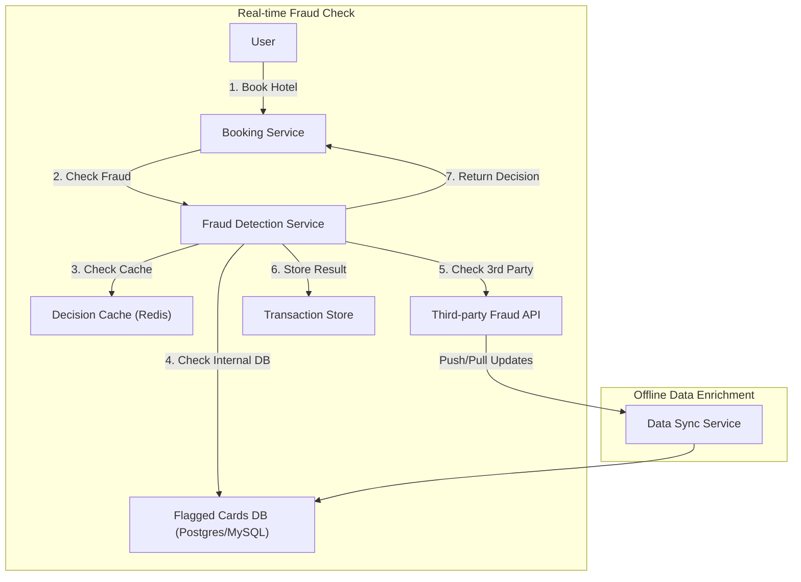

# Fraudulent Credit Card Detection System Design

## Overview

Design a fraud detection system for a "book now, pay later" hotel booking flow. The service should detect and block fraudulent credit cards before bookings are confirmed, using a third-party fraud API and internal transaction data.

## Goals

- Detect fraudulent credit cards in real time during booking.
- Integrate with a third-party fraud list API.
- Block suspicious bookings before confirmation.
- Store flagged transactions and audit history.
- Support high availability and low latency.

## Requirements

### Functional

- Accept booking requests with payment card details.
- Query a third-party fraud API for newly reported fraudulent cards.
- Maintain an internal database of flagged cards and suspicious transactions.
- Block or quarantine bookings that match fraud rules.
- Provide APIs for transaction status, fraud lookup, and administrative review.

### Non-functional

- Real-time performance for booking flows.
- High availability and fault tolerance.
- Strong consistency for fraud status and blocking decisions.
- Secure handling of payment data and PII.
- Clear audit trails for blocked transactions.

## High-level Components

1. Booking API
2. Fraud detection service
3. Third-party fraud API integration
4. Flagged cards database
5. Transaction store
6. Audit and logging
7. Monitoring and alerting

## Architecture

### Architecture Diagram

### 1. Booking API

- Receive booking requests and payment card details.
- Normalize request data and forward to the fraud detection service.
- Apply synchronous checks before confirming booking.

### 2. Fraud Detection Service

- Validate card details and lookup existing fraud state.
- Query third-party API for newly flagged cards.
- Score risk using recent booking patterns, velocity, and card history.
- Block or allow booking requests based on rules.

### 3. Third-Party Fraud API

- Periodically poll or receive push updates for newly reported fraudulent cards.
- Enrich internal data with detection timestamps and source metadata.

### 4. Flagged Cards Database

- Store fraud status for cards and associated entities.
- Record card fingerprints, last-check time, and risk level.
- Support fast lookup during booking.

### Database and cache choices

- Use a relational DB for fraud state when strong consistency and auditability are required.
- Use a fast key-value store like Redis or DynamoDB for lookup cache of recently seen cards.
- Cache third-party fraud responses and block decisions for a short TTL to avoid repeated remote calls.
- Use write-through or cache-aside semantics for the decision cache.

### 5. Transaction Store

- Persist booking attempts, payment metadata, and fraud decision results.
- Capture booking_id, user_id, card_id, status, and timestamps.

### 6. Audit & Logging

- Log all fraud decisions and booking outcomes.
- Capture justification for blocked bookings and rule matches.
- Enable post-incident review and compliance reporting.

### 7. Monitoring and Alerting

- Track failed fraud checks, blocked booking rates, and API latency.
- Alert on unusual spikes in fraud activity.

## Data Model

### Card Status

- `card_id`
- `card_hash`
- `fraud_status`
- `source`
- `last_seen`
- `risk_level`
- `blocked_until`

### Booking Transaction

- `booking_id`
- `user_id`
- `hotel_id`
- `room_id`
- `card_id`
- `amount`
- `status`
- `fraud_decision`
- `decision_reason`
- `timestamp`

## Scalability Considerations

- Cache fraud lookups to avoid repeated API calls for the same card.
- Partition the flagged cards DB by card hash or geographic region.
- Scale the fraud detection service horizontally behind a load balancer.
- Use asynchronous updates for non-blocking audit record writes.

### Machine sizing and flow options

- Fraud decision API: 8–16 vCPU, 32–64 GB RAM for low-latency synchronous checks.
- Cache nodes: 8–16 vCPU, 32–64 GB RAM for Redis/DynamoDB lookup cache.
- Audit store: separate write-optimized cluster for slow writes with event batching.
- Use a hybrid flow: synchronous fraud check for blocking decisions, asynchronous persistence for audit logs and analytics.

## Trade-offs

- Synchronous fraud checks add latency, but offer stronger prevention.
- Caching needs careful invalidation to avoid stale card status.
- Third-party API outages require fallback rules and graceful degradation.

## Interview Talking Points

- Describe how to keep fraud data consistent across services.
- Explain fallback behavior when the third-party API is unavailable.
- Discuss how to reduce false positives while still blocking real fraud.
- Mention security for handling card data and PCI compliance.
