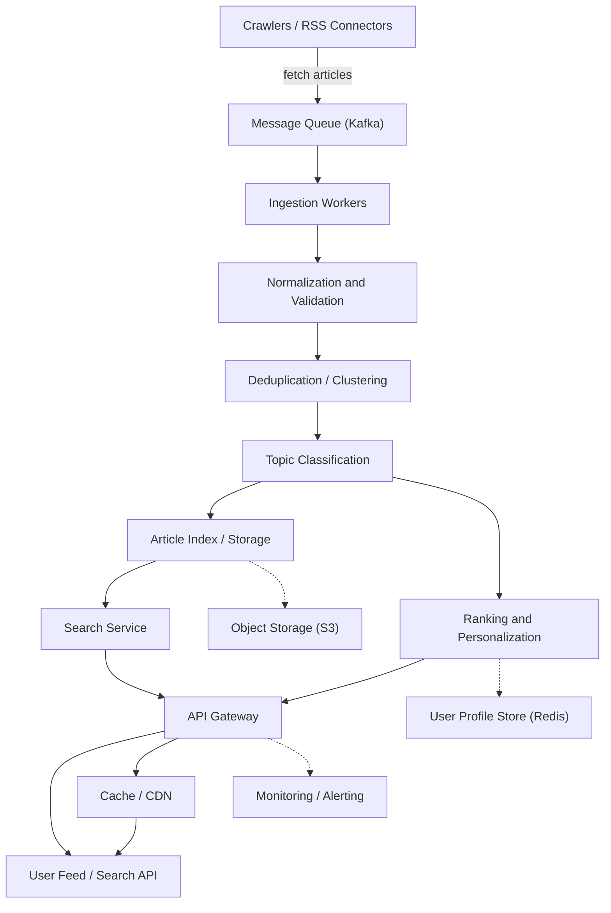

# Google News System Design

## Overview

Design a news aggregation and personalization service similar to Google News. The service should collect news articles from many sources, organize them into topics, rank them for relevance, and present personalized news feeds to users.

## Goals

- Aggregate articles from many publishers and RSS feeds.
- Deduplicate duplicated stories across sources.
- Categorize news into topics, sections, and locations.
- Personalize feeds based on user interests and behavior.
- Support low latency for feed retrieval and search.
- Scale to handle high read and write volumes.

## Core Requirements

### Functional

- Ingest new articles from publishers, RSS feeds, and APIs.
- Store article metadata, content snippets, source information, and timestamps.
- Group related articles into clusters or stories.
- Expose APIs for user feeds, topic pages, search, and article details.
- Support user personalization, saved interests, and trending stories.

### Non-functional

- High availability and low read latency.
- Scalable ingestion and search.
- Strong consistency for article metadata updates, eventual consistency for feeds.
- Fault tolerance and graceful degradation.

## High-level Components

1. Ingestion service
2. Article storage
3. Deduplication and clustering
4. Topic classification and ranking
5. Personalization engine
6. Search service
7. API gateway
8. Caching layer
9. Monitoring and alerting

## Architecture

### Architecture Diagram

### 1. Ingestion

- Use a fleet of crawlers or connectors to fetch feeds from publishers.
- Normalize incoming content into a standard article schema.
- Validate and enrich metadata: source, published time, author, images, and categories.
- Push raw articles into a message queue (e.g. Kafka) for asynchronous processing.

### 2. Article Storage

- Store article metadata in a document database (e.g. Elasticsearch, MongoDB, DynamoDB).
- Keep article text and resource pointers in a storage service (e.g. S3 or object storage).
- Use a relational or NoSQL store for metadata that needs fast point lookups.

### Data store and caching choices

- Use Elasticsearch/OpenSearch when full-text search and faceted filters are a primary requirement.
- Use DynamoDB/Cassandra for fast point lookups and global scale when search can be handled separately.
- Store large article bodies and images in object storage and keep only metadata in the database.
- Cache popular feeds and article detail responses in Redis or CDN edge caches.
- For personalization, keep user profile state in Redis or a fast kv store to avoid frequent backend lookups.

### 3. Deduplication and Clustering

- Compute content signatures or hashes for deduplication.
- Use TF-IDF, MinHash, or semantic similarity to group articles into clusters.
- Maintain a cluster ID and representative article per story.

### 4. Topic Classification

- Apply machine learning models or rule-based classification to assign topics and tags.
- Extract location and entity metadata for local news and breaking stories.
- Store topic assignments in the article index.

### 5. Ranking and Personalization

- Build a ranking service that scores articles using freshness, relevance, authority, click-through signals, and personalization.
- Use user profile data to bias results toward interests and past behavior.
- Keep user sessions and interest metadata in a fast store (e.g. Redis).

### 6. Search and Query

- Use a search engine like Elasticsearch or OpenSearch for full-text search and faceted filters.
- Index article metadata, titles, snippets, entities, and topics.
- Provide APIs for keyword search, filtering by topic/location, and autocomplete.

### 7. API Gateway

- Expose REST or GraphQL APIs for feed retrieval, search, article details, and personalization.
- Authenticate requests when needed and throttle heavy clients.
- Route traffic to backend services and aggregate responses.

### 8. Caching

- Cache hot feeds, topic pages, and article details at the edge with CDN or in-memory caches.
- Use a write-through or invalidation strategy to keep caches fresh after updates.

## Data Flow

1. Crawlers fetch feeds and send raw article events to Kafka.
2. Ingestion workers normalize data and write metadata to the article index.
3. Deduplication and clustering workers group related items.
4. Classification and ranking services enrich each article.
5. User feed requests hit the API gateway, which queries search and personalization services.
6. Cached feed responses are returned quickly for frequent access.

## Data Model

### Article

- `article_id`
- `title`
- `snippet`
- `source`
- `url`
- `published_at`
- `content_hash`
- `topics`
- `cluster_id`
- `image_url`
- `language`
- `location`
- `score`
- `metadata`

### Cluster

- `cluster_id`
- `representative_article_id`
- `topic`
- `story_title`
- `source_count`
- `first_seen`
- `updated_at`

### User Profile

- `user_id`
- `interests`
- `saved_topics`
- `location`
- `recent_clicks`
- `read_history`

## Scaling Considerations

- Partition ingestion events by source or region.
- Shard the search index by time or topic.
- Use separate clusters for real-time ranking and offline analytics.
- Employ fan-out caching for popular feeds.
- Use autoscaling for API services and workers.

### Machine sizing and capacity guidance

- Ingestion workers: 8–16 vCPU with fast local SSD for parsing and enrichment.
- Search/index nodes: 16–32 vCPU, 64–128 GB RAM, and NVMe SSD for Elasticsearch/OpenSearch.
- Personalization/cache nodes: 8–16 vCPU, 32–64 GB RAM for Redis or in-memory profile stores.
- CDN edge layer: Serve cached feed/content near users and reduce origin load.
- Object storage origin: Use S3/GCS with lifecycle policies for media and long-form content.

## Trade-offs

- Strong consistency on ingestion increases latency; eventual consistency is often acceptable for feeds.
- Deduplication at scale is expensive, so approximate clustering is usually preferred.
- Personalization improves relevance but adds system complexity and privacy considerations.

## Interview Talking Points

- Clarify requirements: personalized feed vs. global trending page.
- Discuss data freshness and how often articles are reindexed.
- Describe how to handle spam, low-quality sources, and breaking news prioritization.
- Mention fallback behavior if ranking or classification services are degraded.
- Explain how caching and pagination reduce tail latency.

## Next steps

- Add detailed component diagrams and sequence diagrams.
- Expand the design to cover real-time notifications and push alerts.
- Explore additional features such as local news, user subscriptions, and offline reading.
