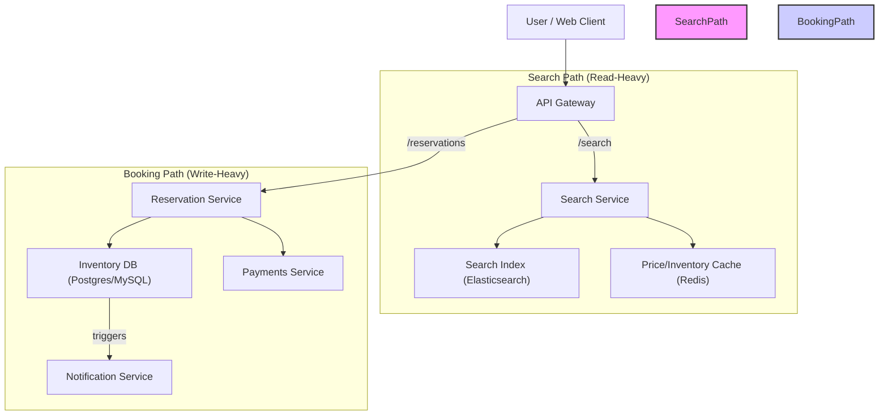

# Hotel Booking System Design

## Overview

Design a hotel booking system that supports users searching for hotels, reserving rooms, and managing bookings at scale. The system should handle high concurrency, maintain inventory, and ensure booking correctness.

## Goals

- Support hotel search, room availability, and reservations.
- Prevent double-booking through concurrency controls.
- Scale to millions of users and bookings.
- Provide a clear data model for hotels, rooms, and reservations.

## Requirements

### Functional

- Search hotels by location, date, and filters.
- Check room availability and pricing.
- Reserve rooms with strong consistency for inventory.
- Update and cancel reservations.
- Support user profiles, payment methods, and booking history.

### Non-functional

- High availability for booking and search services.
- Low latency for search and reservation operations.
- Scalable storage and partitioning.
- Strong correctness for concurrent bookings.

## High-level Components

1. Search service
2. Availability service
3. Reservation service
4. Payments service
5. User profile store
6. Hotel metadata store
7. Cache layer
8. Monitoring and analytics

## Architecture

### Architecture Diagram

!Hotel Booking System Architecture

### 1. Search Service

- Query hotel metadata and availability.
- Use search indexes and caching for fast responses.
- Provide filters for location, price, and amenities.

### 2. Availability Service

- Check room availability for requested dates.
- Reserve inventory temporarily during booking flow.
- Update availability when reservations are confirmed or cancelled.

### Data store and cache choices

- Use a relational database for reservation and inventory state to preserve strong consistency.
- Use an in-memory cache or Redis for hotel metadata, room details, and price lookups.
- Use TTL-based cache invalidation for search results, and event-based invalidation for availability changes.
- Consider a separate search engine (Elasticsearch/OpenSearch) for hotel discovery and faceted filtering.

### 3. Reservation Service

- Manage booking creation, updates, and cancellations.
- Enforce concurrency control using optimistic locking or distributed transactions.
- Ensure room inventory is decremented atomically on confirmation.

### 4. Payments Service

- Handle payment authorization and capture.
- Integrate with payment gateways and billing systems.
- Provide secure handling of payment methods.

### 5. User Profile Store

- Store user accounts, preferences, and booking history.
- Support authentication, saved payment methods, and loyalty data.

### 6. Hotel Metadata Store

- Store hotel and room descriptions, policies, and images.
- Update inventory and pricing data.

### 7. Cache Layer

- Cache frequent search results and price lookups.
- Use TTL-based invalidation for availability-sensitive data.

### 8. Monitoring and Analytics

- Monitor booking throughput, search latency, and inventory levels.
- Analyze demand patterns and system health.

## Data Model

### User

- `user_id`
- `name`
- `email`
- `phone`
- `saved_payment_methods`
- `preferences`

### Hotel

- `hotel_id`
- `name`
- `location`
- `rating`
- `amenities`
- `description`

### Room

- `room_id`
- `hotel_id`
- `room_type`
- `capacity`
- `price`
- `inventory`

### Reservation

- `reservation_id`
- `user_id`
- `hotel_id`
- `room_id`
- `check_in`
- `check_out`
- `status`
- `total_amount`
- `created_at`
- `updated_at`

## Handling Concurrent Bookings

- Use inventory reservations and timeouts to prevent overselling.
- Apply optimistic locking or compare-and-swap on inventory records.
- Use a booking token or hold before final payment capture.
- Scale availability checks with partitioned inventory stores.

## Scalability Considerations

- Shard hotel and booking data by geography or hotel ID.
- Separate read-heavy search services from write-heavy reservation services.
- Use caching for hotel details and price lookups.
- Employ asynchronous workflows for notifications and analytics.

### Machine sizing and cache logic

- API / reservation nodes: 16–32 vCPU, 64–128 GB RAM if they maintain local availability caches.
- Search nodes: 16–32 vCPU, 64–128 GB RAM for Elastic/OpenSearch clusters.
- Inventory DB nodes: 8–16 vCPU, 64 GB RAM, NVMe SSD for strong transactionality.
- Use CDN for static hotel content and images; use cache-control headers on metadata endpoints.
- Use invalidation events when availability changes rather than long TTLs to reduce stale search results.

## Interview Talking Points

- Explain how strong consistency is maintained during booking.
- Discuss partitioning and sharding strategy for large scale.
- Describe failure handling for partial booking or payment failures.
- Mention eventual consistency for search results versus strong consistency for inventory.
