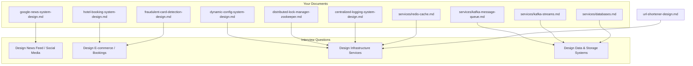

# System Design Interview Question Map

This document maps the common system design interview questions from sources like Design Gurus to your existing, detailed documentation. Use this as a quick reference to find the relevant notes for your preparation.

## Visualization: Your Docs vs. Interview Questions

---

### Social Media & Content Platforms

- **Design Twitter / News Feed / Instagram / Reddit:**
  - Your `google-news-system-design.md` is the most relevant document. It covers the core patterns: content ingestion, deduplication, classification, ranking, and serving personalized feeds.

- **Design YouTube / Netflix:**
  - The ingestion pipeline in `google-news-system-design.md` (Crawlers → Kafka → Processing) is a good starting point for the video upload and transcoding pipeline.

### Messaging & Real-time Systems

- **Design a Notification Service:**
  - The architecture in `services/event-based-triggers.md` and the use of Kafka in `services/kafka-message-queue.md` are the foundational components for a notification system.

### Infrastructure & Platform Services

- **Design a Distributed Cache:**
  - Your `services/redis-cache.md` is a perfect, in-depth guide. The `dynamic-config-system-design.md` also provides a practical application of multi-level caching.

- **Design a Web Crawler:**
  - The "Ingestion" section of `google-news-system-design.md` describes the role of crawlers in the system.

- **Design a Search Engine / Autocomplete:**
  - The "Search and Query" section of `google-news-system-design.md` outlines using Elasticsearch for indexing and search.

### Storage & Data Systems

- **Design a Key-Value Store (like DynamoDB):**
  - `services/databases.md` covers the different database types, including Key-Value stores. The `dynamic-config-system-design.md` also implements a key-value pattern.

### Commerce, Transactions & Marketplaces

- **Design Uber / Airbnb / Ticketing System:**
  - Your `hotel-booking-system-design.md` is highly relevant. It covers search, inventory management, and reservations with concurrency control.

- **Design a Payment System (Stripe):**
  - The `fraudulent-card-detection-design.md` is a critical component of any payment system, focusing on real-time checks and security.