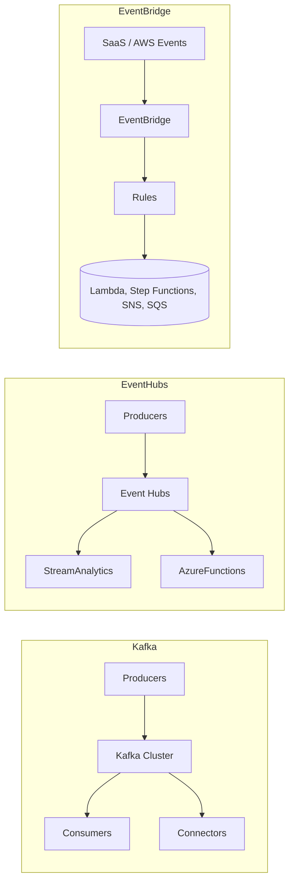

# Messaging and Networking — System Design Reference

This document summarizes practical system-design guidance for five focused topics engineers frequently encounter:

1. Kafka vs AWS EventBridge vs Azure Event Hubs — differences, architecture, and use cases
2. StatefulSet vs Deployment and approaches to consistent hashing in Kubernetes
3. Redis write patterns and durability/consistency options
4. How public traffic reaches Kubernetes pods (cloud-managed clusters)
5. Network model differences across AWS, GCP, and Azure

Each section includes component diagrams (Mermaid) and concise decision-checklists.

---

**1. Kafka, AWS EventBridge, Azure Event Hubs — Differences & Use Cases**

Summary
- Kafka: Distributed, partitioned commit-log. High throughput, low latency, replayable, strong ordering per partition. Best for stream processing, event sourcing, change-data-capture (CDC), and systems that need consumer control and replay.
- AWS EventBridge: Serverless event bus with rich routing rules and SaaS/AWS integrations. Best for application integration, cross-account/service routing, and simple event-driven automation without managing brokers.
- Azure Event Hubs: Managed high-throughput ingestion platform with partitioning and retention; supports Kafka protocol compatibility. Best for telemetry ingestion, analytics pipelines, and streaming into Azure stream processors.

Architectural differences
- Persistence & Replay:
  - Kafka/Event Hubs: durable, configurable retention; consumers can replay.
  - EventBridge: short retention window (minutes/hours depending on plan), not aimed for large-scale replay.
- Protocol & Ecosystem:
  - Kafka: native Kafka protocol, rich ecosystem (Kafka Streams, Connectors, Kafka Streams, ksqlDB).
  - Event Hubs: native API + Kafka protocol endpoint in Azure.
  - EventBridge: AWS event format, rule-driven routing, direct SaaS integrations.
- Throughput & Latency:
  - Kafka & Event Hubs: optimized for very high throughput and low latency.
  - EventBridge: designed for integration, lower throughput ceiling for heavy streaming.

When to pick which
- Choose Kafka when:
  - You require durable event log and consumer replay.
  - You need strong ordering/per-partition and stream processing.
  - You accept operational overhead or use managed Kafka (MSK/Confluent).
- Choose EventBridge when:
  - You want low operational overhead and many AWS/SaaS integrations.
  - You need rule-based routing and serverless event-driven architecture.
- Choose Event Hubs when:
  - You are on Azure and need managed high-throughput ingestion with Kafka compatibility.

Mermaid: high-level comparison




Decision checklist
- Need replay + high throughput → Kafka / Event Hubs
- Need SaaS/AWS routing and serverless integration → EventBridge
- Need managed Kafka protocol on cloud → Event Hubs (or MSK with Kafka)

---

**2. StatefulSet vs Deployment & Consistent Hashing Strategies**

Summary
- `Deployment` (Kubernetes): for stateless, replaceable pods behind Services. Good for horizontally scalable microservices.
- `StatefulSet`: provides stable identity (pod ordinal), stable network identity (DNS), and stable persistent storage per pod. Use for stateful services that require stable storage and identity (databases, Kafka brokers, ZooKeeper nodes).

Consistent hashing roles & options
- Problem: mapping keys (shards) to nodes such that when nodes join/leave, minimal key remapping occurs.
- Approaches:
  1. Client-side consistent hashing (hash ring): clients maintain or fetch ring metadata and route directly to the correct pod/node. Works well with Deployments where pods are fungible.
  2. Proxy/sidecar consistent-hash: an edge proxy (Envoy, HAProxy) performs consistent-hash routing; clients talk to proxy service (Deployment) which routes to the correct backend pod.
  3. StatefulSet + ordinal mapping: when per-pod persistent storage must be guaranteed and identity matters, assign shards based on pod ordinals (pod-0 holds shard 0). Use when data is physically pinned to pods and migration is heavy.

Mermaid: client-side hash vs StatefulSet mapping

!StatefulSet vs Deployment Hashing Strategies

```mermaid
flowchart LR
  # Messaging and Networking — Index

  This folder contains focused, topic-specific design notes. Open any of the files below for a detailed write-up:

  - [Kafka vs AWS EventBridge vs Azure Event Hubs](docs/01-kafka-eventbridge-eventhubs.md)
  - [StatefulSet vs Deployment & Consistent Hashing](docs/02-statefulset-vs-deployment-consistent-hash.md)
  - [Redis Write Options](docs/03-redis-write-options.md)
  - [How Public Network Traffic Reaches Kubernetes Pods](docs/04-k8s-public-network.md)
  - [Network Differences: AWS vs GCP vs Azure](docs/05-cloud-network-differences.md)

  If you'd like an exported ZIP or PDF, or further splits (slides, one-page cheatsheets), tell me which format.