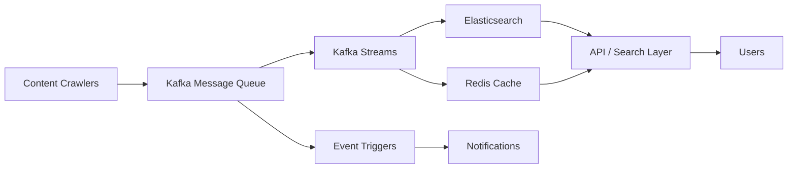

# Services Overview

## Introduction

This directory contains detailed documentation for all critical services used in the Google News system design. Each service provides specific capabilities for building a scalable, event-driven, real-time news aggregation platform.

## Visualization



## Quick Reference Table

| Service | Purpose | Throughput | Latency | Key Features |
|---------|---------|-----------|---------|--------------|
| **Kafka Message Queue** | Event streaming & ingestion | 1M+ msg/sec | 1-50ms | Durable, fault-tolerant, multi-consumer |
| **Kafka Streams** | Real-time stream processing | 500K-2M evt/sec | 1-10ms | Stateful, joins, windowing, no cluster needed |
| **Redis Cache** | In-memory caching & state | 100K-1M ops/sec | <1ms | Sub-millisecond, data structures, pub/sub |
| **Event-Based Triggers** | Reactive event handling | Unlimited | <100ms | Decoupling, multi-stage pipelines, pattern matching |
| **Connection Pool** | Resource reuse & management | Scales linearly | <1ms overhead | Reuse, efficiency, fault tolerance |

## Service Dependencies & Integration

```
┌─────────────────────────────────────────────────┐
│         API Gateway / Crawlers                   │
└────────────┬────────────────────────────────────┘
             │ Raw Articles / Events
             ↓
┌─────────────────────────────────────────────────┐
│    Kafka Message Queue (raw-articles topic)     │
├─────────────────────────────────────────────────┤
│  └─ Kafka Streams (Deduplication Pipeline)      │
│  └─ Kafka Streams (Classification Pipeline)     │
│  └─ Event-Based Triggers (on article.published) │
└────────┬────────────────────────────┬───────────┘
         │                            │
         ↓                            ↓
  ┌────────────────┐         ┌──────────────────┐
  │ Elasticsearch  │         │  Redis Cache     │
  │ (Persistent)   │         │ (Profile, Feeds) │
  └────────────────┘         └──────────────────┘
         │                            │
         └──────────────┬─────────────┘
                        ↓
             ┌──────────────────────┐
             │  Feed Ranking        │
             │  Service             │
             └──────────────────────┘
                        │
                        ↓
             ┌──────────────────────┐
             │  User Request        │
             │  (REST API Gateway)  │
             └──────────────────────┘
```

## When to Use Each Service

### Use Kafka Message Queue When:
- Need high-volume event ingestion (1000s/sec)
- Multiple services consume same data
- Durability and replay capability required
- Multi-stage pipeline with queuing
- Example: Article crawlers → Kafka → Multiple consumers

### Use Kafka Streams When:
- Need real-time transformation/aggregation
- Require stateful processing (deduplication, windowing)
- Single Kafka cluster sufficient (no cross-cluster needs)
- Low latency critical (1-10ms)
- Example: Deduplicate articles, detect trending stories in real-time

### Use Redis Cache When:
- Sub-millisecond latency required
- Caching hot data (80/20 access patterns)
- Session/temporary state management
- Real-time counters or rankings
- Example: User profiles, cached feeds, trending article lists

### Use Event-Based Triggers When:
- Need to decouple services from data changes
- Multi-stage event pipelines
- User action tracking (clicks, saves)
- Cache invalidation patterns
- Pattern matching (e.g., breaking news detection)
- Example: On article published → trigger dedup → trigger classification → trigger ranking

### Use Connection Pool When:
- Need to reuse expensive connections
- High-throughput request handling
- Resource constraint on backend
- Multiple threads/services accessing same resources
- Example: Database connection pooling, Redis pooling, HTTP client pooling

## Other Important Services

### API Gateway / Load Balancer
- When: Fronting APIs, enforcing auth, rate limiting, routing traffic.
- Where: Between clients and backend services, at the edge of the service mesh.
- Options: NGINX, Envoy, Kong, AWS API Gateway, Istio ingress, HAProxy.
- Effective use: Keep routing simple, offload auth/SSL, use circuit breakers and retries at the gateway, and keep the gateway stateless.

### Authentication / Authorization
- When: Protecting APIs, enforcing user roles, securing admin tools.
- Where: At the API boundary and inside microservices for fine-grained access control.
- Options: OAuth/OIDC providers, JWT tokens, Auth0, Keycloak, AWS Cognito.
- Effective use: Validate tokens at the gateway, cache authorization decisions, and separate identity management from service logic.

### Search / Indexing
- When: Supporting full-text search, autocomplete, filtering, and relevance ranking.
- Where: As a dedicated search layer alongside primary data stores.
- Options: Elasticsearch, OpenSearch, Solr, Meilisearch.
- Effective use: Index only query-relevant fields, keep the index near real-time for freshness, and use a separate cluster for analytics workloads.

### Object Storage
- When: Storing large assets, media, archives, or backups.
- Where: For immutable content and binary objects outside the database.
- Options: AWS S3, Google Cloud Storage, Azure Blob Storage, MinIO.
- Effective use: Store pointers in the database, use CDN for delivery, and apply lifecycle policies to control retention and cost.

### Monitoring / Observability
- When: Tracking system health, latency, errors, and capacity.
- Where: Across all infrastructure layers: apps, brokers, cache, databases, pipelines.
- Options: Prometheus, Grafana, Datadog, CloudWatch, OpenTelemetry, Jaeger.
- Effective use: Collect metrics, distributed traces, and logs; define alerts on SLAs and use dashboards for root cause analysis.

### Analytics / BI
- When: Measuring engagement, trends, business KPIs, and offline insights.
- Where: In a separate analytics pipeline or data warehouse.
- Options: Spark, Flink, BigQuery, Snowflake, Redshift, ClickHouse.
- Effective use: Use event streams or CDC to feed analytics, keep analytics separate from OLTP workloads, and precompute dashboards.

### ML Model Serving
- When: Serving personalization, classification, and ranking models in real time.
- Where: Near the service generating recommendations or inside a model serving tier.
- Options: TensorFlow Serving, TorchServe, Seldon, BentoML, AWS SageMaker.
- Effective use: Cache model predictions for repeated traffic, use feature stores for consistent inputs, and version your models.

### Workflow / Task Orchestration
- When: Coordinating scheduled jobs, long-running flows, or retryable ETL tasks.
- Where: For batch pipelines, retry logic, and dependency management.
- Options: Airflow, Temporal, Prefect, AWS Step Functions.
- Effective use: Keep workflows declarative, separate orchestration from execution, and track state to recover failed tasks.

### CDN / Edge Cache
- When: Serving static content or cached feed responses to global users.
- Where: At the network edge, close to users.
- Options: Cloudflare, Fastly, AWS CloudFront, Akamai.
- Effective use: Cache public content aggressively, use cache invalidation for updates, and offload origin traffic.

### Config / Feature Flag Management
- When: Rolling out features, managing runtime behavior, and controlling deployment flags.
- Where: Central configuration layer shared across services.
- Options: LaunchDarkly, Unleash, ConfigMap, Consul, custom config service.
- Effective use: Keep config centralized, use feature flags for safe rollouts, and avoid hard-coded values in service code.

## Architecture Patterns

### Pattern 1: Ingestion to Serving

```
Crawlers 
  ↓
Kafka (raw-articles) 
  ↓
Kafka Streams (normalize, deduplicate)
  ↓
Elasticsearch (indexed articles)
  ↓
Redis (top 100 cached)
  ↓
API Gateway → User Feed Request
```

### Pattern 2: Real-time Personalization

```
User Click Event
  ↓
Kafka (user.actions)
  ↓
Event-Based Trigger
  ↓
Personalization Service → Redis (update user profile)
  ↓
Next request hits fresh profile data
```

### Pattern 3: Cascading Events

```
Article Published
  ↓
Event Trigger: article.published
  ├─→ Handler 1: Ingest & Normalize (via Kafka)
  ├─→ Handler 2: Deduplicate (via Kafka Streams)
  └─→ Handler 3: Classify (via Kafka Streams)
  ↓
Events Complete → Event Trigger: article.processed
  ├─→ Handler 1: Update Elasticsearch (Connection Pool)
  ├─→ Handler 2: Invalidate Redis cache
  └─→ Handler 3: Update Trending Lists
```

## Scaling Guidelines

### Small System (1K articles/day)
- **Kafka**: Single broker, 3 partitions
- **Redis**: Single instance, 8GB
- **Connection Pool**: 20 connections
- **Kafka Streams**: 2 threads
- **Estimated Cost**: $500/month

### Medium System (1M articles/day)
- **Kafka**: 3 brokers, 50 partitions
- **Redis**: Cluster (6 nodes), 64GB total
- **Connection Pool**: 100 connections
- **Kafka Streams**: 16 threads × 3 instances
- **Estimated Cost**: $5,000/month

### Large System (1B articles/day)
- **Kafka**: 10+ brokers, 1000+ partitions
- **Redis**: Multi-cluster, 1TB+ total
- **Connection Pool**: 1000+ connections
- **Kafka Streams**: 32 threads × 100+ instances
- **Estimated Cost**: $50,000+/month

## Common Pitfalls & Solutions

### Pitfall 1: Kafka Throughput Bottleneck
- **Problem**: Single broker can't keep up
- **Solution**: Partition strategy, increase broker count
- **Related Service**: Kafka Message Queue

### Pitfall 2: Redis Memory Exhaustion
- **Problem**: Cache grows unbounded, evictions increase
- **Solution**: Set appropriate TTL, use eviction policy
- **Related Service**: Redis Cache

### Pitfall 3: Connection Pool Deadlock
- **Problem**: All connections busy, new requests blocked
- **Solution**: Right-size pool, implement queue, fallback logic
- **Related Service**: Connection Pool

### Pitfall 4: Duplicate Event Processing
- **Problem**: Same event triggers handlers multiple times
- **Solution**: Idempotent handler design, deduplication key
- **Related Service**: Event-Based Triggers

### Pitfall 5: Kafka Streams State Explosion
- **Problem**: State stores grow unbounded
- **Solution**: Implement windowing, set retention policy
- **Related Service**: Kafka Streams

## Performance Benchmarks

### Ingestion Pipeline
```
Raw Article → Kafka: 5ms
Kafka → Deduplication: 50ms (with state lookup)
Deduplication → Classification: 100ms (ML model)
Classification → Elasticsearch: 30ms
Total P99 Latency: 500ms
Throughput: 1000 articles/sec
```

### Feed Generation
```
User Request → API: 10ms
API → Redis (profile): 1ms
Redis (profile) → Elasticsearch (personalized): 50ms
Elasticsearch → Redis (cache): 30ms
Total P99 Latency: 200ms
Cache Hit Rate: 95%
```

### Real-time Trending Detection
```
Article Event → Kafka Streams: 2ms
Kafka Streams (windowed aggregation): 20ms
Result → Event Trigger: 5ms
Trigger → Notification Service: 50ms
Total P99 Latency: 150ms
Detection window: 1-5 minutes
```

## Monitoring & Observability

### Key Metrics per Service

**Kafka Message Queue**
- Consumer lag (per topic, partition)
- Broker CPU/memory utilization
- Message throughput (prod/cons rate)
- ISR (in-sync replicas) status

**Kafka Streams**
- Processing rate and latency
- State store size
- Thread utilization
- Task rebalancing frequency

**Redis Cache**
- Memory utilization
- Hit rate / miss rate
- Connection pool usage
- Operation latency (p50, p99)

**Event-Based Triggers**
- Event processing rate
- Handler success/failure rate
- Dead letter queue size
- End-to-end latency

**Connection Pool**
- Active/idle/waiting connections
- Wait time for connection acquisition
- Connection validation failures
- Pool exhaustion events

## References

- [Kafka Message Queue](kafka-message-queue.md)
- [Kafka Streams](kafka-streams.md)
- [Redis Cache](redis-cache.md)
- [Event-Based Triggers](event-based-triggers.md)
- [Connection Pool Management](connection-pool.md)
- [Databases](databases.md)
- [Connection Pool Management](connection-pool.md)

## Further Reading

- Apache Kafka Documentation: https://kafka.apache.org/documentation/
- Kafka Streams Tutorial: https://kafka.apache.org/documentation/streams/
- Redis Official: https://redis.io/
- Event-Driven Architecture: https://www.oreilly.com/library/view/building-event-driven-systems/
- Connection Pooling Best Practices: https://wiki.postgresql.org/wiki/Performance_Optimization

