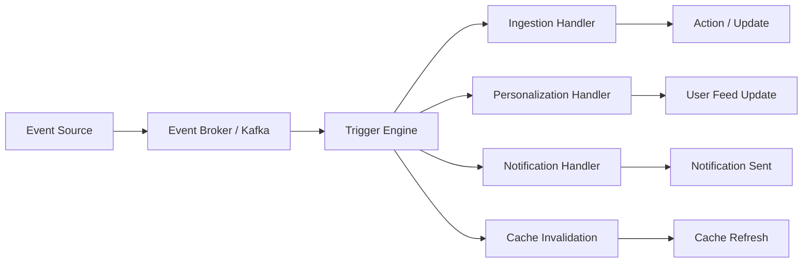
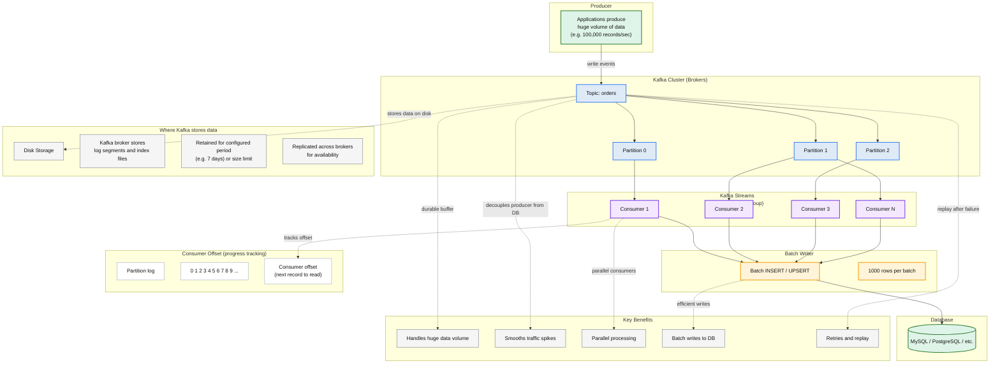

# Event-Based Triggers

## Overview
Event-based triggers are mechanisms that detect changes or specific conditions in the system and automatically execute associated actions. They decouple services and enable reactive, event-driven architectures for the Google News system.

## Visualization



## Kafka Buffering Architecture



## Use Cases

### In Google News System
1. **Article Published Event**: Trigger ingestion pipeline when new articles arrive
2. **User Action Triggers**: Personalization updates when user clicks, saves, or shares
3. **Trending Article Detection**: Trigger notifications when article engagement threshold exceeded
4. **Source Outage Detection**: Automatically adjust crawling frequency or alert
5. **Cache Invalidation**: Update caches when articles are updated or removed
6. **User Interest Changes**: Re-rank feeds when user preferences change
7. **SLA Violations**: Alert operations when processing latency exceeds thresholds
8. **Scheduled Tasks**: Time-based triggers for batch processing and analytics

## How It Works

### Event-Driven Architecture Pattern

```
Event Source (Publisher)
    ↓
Event Broker (Kafka/Message Queue)
    ├─ Topic: article.published
    ├─ Topic: user.action
    ├─ Topic: article.trending
    └─ Topic: system.alert
    ↓
Event Handlers (Subscribers/Consumers)
    ├─ Ingestion Service
    ├─ Personalization Service
    ├─ Notification Service
    ├─ Analytics Pipeline
    └─ Cache Manager
```

### Event Flow Example

```
Step 1: Event Emission
├─ Article crawler discovers new article
└─ Emits: { type: "article.published", article_id: 123, timestamp: ... }

Step 2: Event Routing
├─ Event broker receives and routes to subscribers
└─ Kafka Topic: "article.events"

Step 3: Multi-Consumer Processing
├─ Deduplication Service → Checks for duplicates
├─ Classification Service → Assigns topics/tags
├─ Personalization Service → Computes relevance scores
└─ Notification Service → Alerts subscribed users

Step 4: State Updates & Side Effects
├─ Update article index
├─ Cache invalidation
└─ Publish derived events
```

## Types of Triggers

### 1. Data Change Triggers

```python
class DataChangeTrigger:
    """Fired when data is created, updated, or deleted"""
    
    def on_article_created(self, article):
        # Trigger events
        trigger_ingestion_pipeline(article)
        trigger_deduplication(article)
        trigger_classification(article)
    
    def on_article_updated(self, old_article, new_article):
        # Detect what changed
        if old_article['score'] != new_article['score']:
            trigger_feed_reranking()
        
        if old_article['content'] != new_article['content']:
            trigger_search_index_update()
        
        # Invalidate caches
        invalidate_cache(f"article:{old_article['id']}")
    
    def on_article_deleted(self, article):
        remove_from_feeds()
        invalidate_cache(f"article:{article['id']}")
```

### 2. User Action Triggers

```python
class UserActionTrigger:
    """Fired when user interacts with content"""
    
    def on_article_click(self, user_id, article_id):
        # Update user profile
        update_user_engagement(user_id, article_id)
        
        # Trigger personalization update
        trigger_personalization_recompute(user_id)
        
        # Log for analytics
        log_event("article.clicked", {
            'user_id': user_id,
            'article_id': article_id,
            'timestamp': time.time()
        })
    
    def on_article_saved(self, user_id, article_id):
        save_to_user_library(user_id, article_id)
        trigger_recommendation_update(user_id)
    
    def on_interests_updated(self, user_id, new_interests):
        # Invalidate cached profile
        cache.delete(f"profile:{user_id}")
        
        # Trigger immediate feed refresh
        trigger_feed_generation(user_id, force=True)
```

### 3. Threshold-Based Triggers

```python
class ThresholdTrigger:
    """Fired when metric crosses threshold"""
    
    def check_trending_article(self, article_id):
        view_count = get_article_views(article_id)
        time_window = "1_hour"
        
        if view_count > TRENDING_THRESHOLD:  # e.g., 10,000 views/hour
            trigger_trending_notification(article_id)
            promote_to_homepage(article_id)
            update_trending_list(article_id)
    
    def check_latency_sla(self, service_name, latency_ms):
        if latency_ms > SLA_THRESHOLD:  # e.g., 500ms
            trigger_alert(f"{service_name} SLA violation")
            trigger_autoscaling(service_name)
            trigger_incident_creation(service_name)
    
    def check_source_health(self, source_id, fail_count):
        if fail_count > FAILURE_THRESHOLD:  # e.g., 5 failures in 10 min
            disable_source_crawling(source_id)
            trigger_alert(f"Source {source_id} is unhealthy")
```

### 4. Time-Based Triggers (Scheduled)

```python
class TimedTrigger:
    """Scheduled/cron-based triggers"""
    
    @schedule.every().hour
    def refresh_trending_topics(self):
        articles = get_trending_articles(hours=1)
        update_trending_cache(articles)
    
    @schedule.every().day.at("02:00")
    def daily_analytics_job(self):
        compute_daily_metrics()
        generate_reports()
        cleanup_old_data()
    
    @schedule.every(30).seconds
    def monitor_system_health(self):
        check_broker_health()
        check_cache_health()
        check_db_connection_pool()
```

### 5. Pattern-Matching Triggers

```python
class PatternTrigger:
    """Complex event pattern matching"""
    
    def detect_breaking_news_pattern(self):
        """Detect when multiple sources report same event rapidly"""
        # Pattern: 5+ articles on same topic within 10 minutes
        
        recent_articles = get_articles_by_time_window(10)  # 10 min window
        grouped = group_by_topic(recent_articles)
        
        for topic, articles in grouped.items():
            if len(articles) >= 5:
                trigger_breaking_news_alert(topic, articles)
                promote_to_breaking_news_section()
    
    def detect_user_behavior_anomaly(self, user_id):
        """Detect unusual user activity"""
        recent_clicks = get_user_click_history(user_id, hours=24)
        
        if len(recent_clicks) > 10 * NORMAL_AVERAGE:
            # Possible bot or abuse
            trigger_fraud_detection(user_id)
```

## Implementation Patterns

### Pattern 1: Kafka + Kafka Streams Triggers

```python
from kafka import KafkaProducer, KafkaConsumer
import json

class EventTriggerEngine:
    def __init__(self):
        self.producer = KafkaProducer(
            bootstrap_servers=['localhost:9092'],
            value_serializer=lambda v: json.dumps(v).encode('utf-8')
        )
    
    def emit_event(self, event_type, payload):
        """Emit event to event stream"""
        event = {
            'type': event_type,
            'payload': payload,
            'timestamp': time.time()
        }
        self.producer.send(f"events.{event_type}", event)
    
    def register_trigger(self, event_type, handler_function):
        """Register handler for specific event type"""
        consumer = KafkaConsumer(
            f"events.{event_type}",
            bootstrap_servers=['localhost:9092'],
            value_deserializer=lambda m: json.loads(m.decode('utf-8'))
        )
        
        for message in consumer:
            event = message.value
            try:
                handler_function(event['payload'])
            except Exception as e:
                log_error(f"Trigger failed: {e}")
                publish_to_dead_letter_queue(event)

# Usage
engine = EventTriggerEngine()

def on_article_published(article):
    print(f"Processing article: {article['id']}")
    trigger_deduplication(article)
    trigger_classification(article)

engine.register_trigger('article.published', on_article_published)
```

### Pattern 2: Database Triggers (CDC - Change Data Capture)

```python
from debezium import CdcSource

class CDCEventTrigger:
    """Using Change Data Capture for database triggers"""
    
    def __init__(self):
        self.cdc = CdcSource(
            database='news_db',
            tables=['articles', 'user_profiles']
        )
        self.cdc.start()
    
    def subscribe_to_changes(self):
        for change in self.cdc.stream():
            if change['table'] == 'articles':
                if change['op'] == 'INSERT':
                    self.on_article_created(change['after'])
                elif change['op'] == 'UPDATE':
                    self.on_article_updated(change['before'], change['after'])
                elif change['op'] == 'DELETE':
                    self.on_article_deleted(change['before'])
    
    def on_article_created(self, article):
        invalidate_cache(f"article:{article['id']}")
        trigger_search_indexing(article)
```

### Pattern 3: Webhook-Based Triggers

```python
from flask import Flask, request

app = Flask(__name__)

class WebhookTrigger:
    """External system triggering internal events"""
    
    @app.route('/webhook/article', methods=['POST'])
    def receive_article_event(self):
        data = request.get_json()
        event_type = data.get('event_type')
        
        if event_type == 'article_published':
            trigger_article_ingestion(data['article'])
        elif event_type == 'article_removed':
            trigger_article_removal(data['article_id'])
        
        return {'status': 'ok'}, 200
```

## Configuration & Best Practices

### Trigger Configuration

```yaml
# triggers-config.yaml
triggers:
  article_published:
    event_source: kafka
    topic: article.events
    handlers:
      - deduplication_service
      - classification_service
      - personalization_service
    error_handling: dead_letter_queue
    retry_policy:
      max_retries: 3
      backoff: exponential

  user_clicked_article:
    event_source: kafka
    topic: user.actions
    handlers:
      - engagement_tracker
      - personalization_engine
    filter: "article_type == 'news'"
    throttle: 100ms  # Avoid rapid consecutive triggers

  trending_article_detected:
    event_source: kafka_streams
    pattern: "5+ articles within 10 minutes"
    handlers:
      - notification_service
      - homepage_updater
    severity: high
```

## Effective Use Cases

### Ideal Scenarios
✅ Decoupling services that depend on data changes
✅ Real-time event processing (< 100ms latency)
✅ Multi-stage pipelines (chained events)
✅ User interaction tracking and analytics
✅ Cache invalidation on data updates
✅ Alert generation and notifications
✅ Asynchronous task execution
✅ Audit logging and compliance

### Not Suitable For
❌ Strong transactional consistency (use database transactions)
❌ Exactly-once guarantee without idempotency design
❌ Complex multi-step orchestration (use workflow engines)
❌ Human approval workflows (use BPM systems)

## Reliability & Fault Tolerance

### Idempotent Triggers

```python
class IdempotentTrigger:
    """Ensure trigger handlers are idempotent"""
    
    def trigger_cache_invalidation(self, article_id):
        # Safe to call multiple times - delete is idempotent
        cache.delete(f"article:{article_id}")
    
    def trigger_search_reindex(self, article_id):
        # Safe to call multiple times - idempotent in Elasticsearch
        update_search_index(article_id, force=True)
```

### Dead Letter Queue for Failed Triggers

```python
class FailureHandling:
    
    def handle_trigger_failure(self, event, error):
        # Log the failure
        logger.error(f"Trigger failed: {error}", extra={'event': event})
        
        # Send to DLQ for manual review
        dlq_producer.send('trigger-failures', {
            'event': event,
            'error': str(error),
            'timestamp': time.time()
        })
        
        # Alert operations
        send_alert(f"Trigger failure: {error}")
```

## Monitoring Triggers

### Key Metrics

| Metric | Description | Alert Threshold |
|--------|-------------|-----------------|
| Trigger Latency | Time from event to handler execution | p99 > 1000ms |
| Handler Success Rate | % of successful executions | < 99% |
| DLQ Message Rate | Messages in dead letter queue | > 10/minute |
| Backlog Size | Pending trigger executions | > 1000 events |
| Trigger Count | Events processed per second | Baseline ± 50% |

## Cost & Performance Considerations

- **Event Broker Overhead**: 5-10% CPU overhead for event routing
- **Cascading Latency**: Chain of triggers adds 10-100ms per stage
- **Message Storage**: Event retention doubles storage requirements

## Comparison with Alternatives

| Approach | Pros | Cons |
|----------|------|------|
| **Kafka Events** | Durable, scalable, replay | Network latency, complexity |
| **Webhooks** | Simple, synchronous | Harder to scale, retry logic |
| **Database Triggers** | Transactional, atomic | Limited to single database |
| **Message Queue (RabbitMQ)** | Flexible, ack-based | Lower throughput than Kafka |
| **Apache Airflow** | Complex workflows, scheduling | Overkill for simple events |
