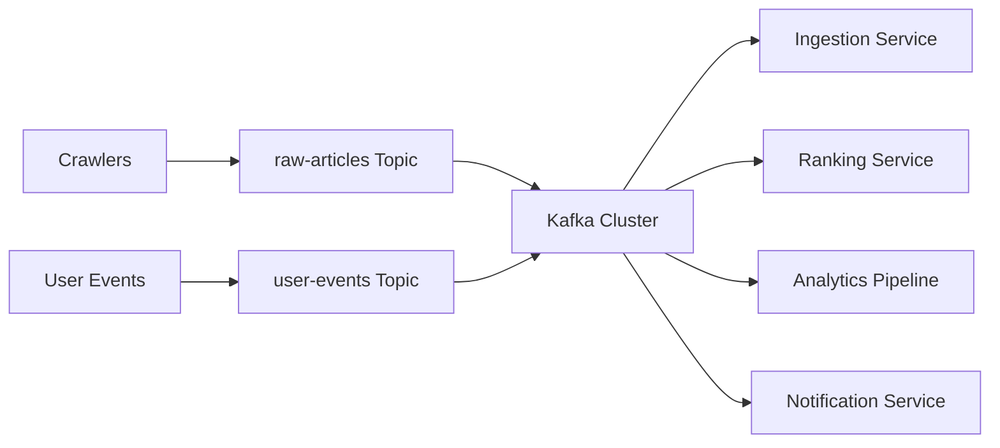

# Kafka Message Queue

## Overview
Apache Kafka is a distributed event streaming platform designed for high-throughput, fault-tolerant, and scalable message processing. It acts as a central hub for real-time data flows in the Google News system.

## Visualization



## Use Cases

### In Google News System
1. **Article Ingestion Pipeline**: Raw articles from crawlers are pushed to Kafka before normalization
2. **Event Logging**: User interactions, clicks, and feed views flow through Kafka
3. **Cross-Service Communication**: Decoupling between ingestion, deduplication, classification, and ranking services
4. **Data Replication**: Ensuring messages reach multiple downstream consumers

## How It Works

### Core Concepts

- **Producer**: Crawlers send raw articles to Kafka topics
- **Topic**: Logical channel for messages (e.g., `raw-articles`, `user-events`, `article-updates`)
- **Partition**: Splits topics for parallelism and scalability
- **Consumer Group**: Multiple workers consume from same topic in parallel
- **Offset**: Position tracking ensures no message loss or duplication

### Data Flow

```
Crawlers (Producers) 
    ↓
    └→ Kafka Cluster (Multiple Brokers)
            ├─ Topic: raw-articles (Partitions: 0,1,2...)
            ├─ Topic: user-events
            └─ Topic: article-updates
    ↓
Consumers (Ingestion Workers, Ranking Service, Analytics)
```

## Configuration Options

### Key Parameters

| Parameter | Description | Recommended Value |
|-----------|-------------|-------------------|
| `num.partitions` | Number of partitions per topic | 12-50 (based on throughput) |
| `replication.factor` | Number of broker copies | 3 (for high availability) |
| `retention.ms` | Message retention time | 7 days for raw data, 30 days for events |
| `retention.bytes` | Max storage per partition | 100 GB per partition |
| `compression.type` | Message compression | snappy (balance of speed & size) |
| `acks` | Producer acknowledgment level | all (strong consistency) |
| `batch.size` | Producer batch size | 16 KB |
| `linger.ms` | Producer wait time for batching | 10 ms |

### Consumer Configuration

```properties
group.id=ingestion-workers
max.poll.records=500
fetch.min.bytes=10240
fetch.max.wait.ms=500
session.timeout.ms=30000
```

## Effective Use Cases

### Ideal Scenarios
✅ High-volume article ingestion (1000s articles/second)
✅ Asynchronous processing pipelines
✅ Multi-consumer scenarios (same data → different services)
✅ Event-driven architecture
✅ Durability and fault tolerance requirements
✅ Time-series event data

### Not Suitable For
❌ Guaranteed exactly-once delivery without idempotency
❌ Low-latency request-response patterns (use gRPC/REST)
❌ Transactional consistency across multiple systems
❌ Small-scale, simple queuing (RabbitMQ is lighter)

## Performance Metrics

- **Throughput**: 1M+ messages/second per cluster
- **Latency**: p50: 1-5ms, p99: 10-50ms
- **Durability**: No message loss with proper configuration
- **Scalability**: Horizontal scaling by adding brokers

## Operational Considerations

### Scaling Strategy
- Start with 3 brokers, scale to 5-7 for production
- Use 50-100 partitions for balanced parallelism
- Monitor consumer lag; scale consumers if lag > 10 minutes

### Monitoring
- Consumer lag (per partition, per consumer group)
- Broker CPU and memory utilization
- Replication lag across brokers
- Producer and consumer throughput

### Failure Handling
- In-sync replicas (ISR) ensure durability
- Producer retry logic with exponential backoff
- Consumer offset management and rebalancing

## Integration with Google News System

```
Raw Articles → Kafka Topic: raw-articles → Partition 0,1,2...
                              ↓
                    Ingestion Workers (Consumer Group A)
                              ↓
                    Normalize & Enrich
                              ↓
                    Kafka Topic: normalized-articles
                              ↓
                    ├─ Deduplication Service (Consumer Group B)
                    ├─ Classification Service (Consumer Group C)
                    └─ Ranking Service (Consumer Group D)
```

## Alternatives

| Alternative | Pros | Cons |
|------------|------|------|
| **RabbitMQ** | Lightweight, easy setup | Lower throughput, limited scalability |
| **AWS SQS** | Managed, no ops overhead | Higher latency, queue limitations |
| **Google Pub/Sub** | Managed, good for GCP | Cost, vendor lock-in |
| **Redis Streams** | Low latency, simple | Not persistent by default, no clustering |
| **Event Hubs** | Scalable, Azure-native | Vendor lock-in, complexity |

## Cost Estimation

For 1M articles/day (~12 msg/sec baseline, peaks to 100 msg/sec):
- **Infrastructure**: 3 brokers × $500/month = $1,500/month
- **Storage**: 7-day retention × 1KB/article = ~8 GB = minimal
- **Network**: Inter-broker replication and consumer bandwidth = $200/month
- **Total**: ~$1,700/month for Kafka cluster

