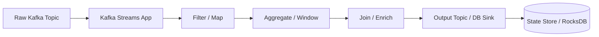

# Kafka Streams

## Overview
Kafka Streams is a client library for building streaming applications that process data in Apache Kafka. It enables stateful transformations, aggregations, and joins directly on data flowing through Kafka topics without requiring a separate stream processing cluster.

## Visualization




!Kafka Streams Pipeline: From Event Ingestion to Durable Analytics

## Use Cases

### In Google News System
1. **Real-time Deduplication**: Identify duplicate articles using windowed aggregations
2. **Content Enrichment**: Add metadata, classification, and tags to articles in real-time
3. **Aggregations**: Count articles per topic, track trending stories
4. **Joins**: Correlate articles with user profiles for personalization
5. **Stateful Processing**: Track article versions and update history
6. **Time-windowed Analytics**: Calculate moving averages of engagement metrics

## How It Works

### Core Architecture

```
Input Topic (raw-articles)
        ↓
  Kafka Streams App
  (Embedded in your service)
        ├─ Stream Processing Topology
        │  ├─ Filter: Remove low-quality articles
        │  ├─ Map: Normalize and enrich content
        │  ├─ Aggregate: Group by topic with 5-min windows
        │  └─ Join: Correlate with user interests
        ↓
  State Stores (Local + Remote)
        ├─ In-Memory Cache
        └─ RocksDB (Persistent)
        ↓
Output Topic (processed-articles)
```

### Processing Topology Example

```
Source: raw-articles-topic
    ↓
[Filter] Remove spam/low-quality
    ↓
[Map] Parse and normalize
    ↓
[Branch]
    ├─→ [Aggregate] Count by topic (5-min window) → topic-counts-store
    │       ↓
    │   trending-topics-topic
    │
    └─→ [Join] With user-interests (KStream-KTable join)
            ↓
        user-personalized-articles
```

## Configuration Options

### Key Parameters

| Parameter | Description | Recommended Value |
|-----------|-------------|-------------------|
| `application.id` | Unique app identifier for state | `article-processor-v1` |
| `bootstrap.servers` | Kafka brokers | `broker1:9092,broker2:9092` |
| `default.key.serde` | Key serialization | StringSerde |
| `default.value.serde` | Value serialization | JsonSerde |
| `state.dir` | Local state store location | `/var/kafka-streams` |
| `num.stream.threads` | Parallelism within app | 8-16 |
| `cache.max.bytes.buffering` | Local cache size | 10 MB |
| `commit.interval.ms` | State commit frequency | 30,000 ms |

### Topology Settings

```properties
# High throughput
num.stream.threads=16
cache.max.bytes.buffering=50000000

# High consistency
commit.interval.ms=5000
state.cleanup.delay.ms=600000

# Interactive queries
rocksdb.config.setter=org.apache.kafka.streams.state.internals.RocksDBConfigSetter
```

## Effective Use Cases

### Ideal Scenarios
✅ Real-time transformations with sub-second latency
✅ Stateful processing (aggregations, windowing, joins)
✅ Processing volume: 100K to 1M events/second per instance
✅ No external state management needed
✅ Single Kafka cluster as both input and output
✅ Event-time semantics important

### Not Suitable For
❌ Cross-cluster federation or data movement
❌ Complex SQL queries (use Flink or Spark)
❌ Transaction support across multiple systems
❌ Strict ordering across independent streams
❌ ML model serving (use specialized platforms)

## Performance Characteristics

### Throughput
- Per stream thread: 500K-2M events/second
- Scales linearly with number of threads and app instances

### Latency
- Processing latency: 1-10ms (in-memory operations)
- End-to-end latency: 100-1000ms (includes Kafka broker)
- State store access: <1ms (RocksDB)

### State Management
- Local state with changelog topic for recovery
- Automatic rebalancing on app restart or scaling

## Integration with Google News System

### Real-time Article Deduplication Pipeline

```python
from kafka import KafkaConsumer, KafkaProducer
from kafka.streams import KafkaStreams, StreamsBuilder
from kafka.streams.kstream import KStream
from kafka.streams.state import WindowStore

builder = StreamsBuilder()

# Source stream of raw articles
articles = builder.stream("raw-articles")

# Filter low-quality content
quality_articles = articles.filter(
    lambda key, article: article['word_count'] > 50
)

# Aggregate by content hash (5-minute tumbling window)
article_dedup = quality_articles \
    .map(lambda key, article: (article['content_hash'], article)) \
    .groupByKey() \
    .windowedBy(TimeWindows.of(Duration.ofMinutes(5))) \
    .aggregate(
        initializer=lambda: [],
        adder=lambda key, value, agg: agg + [value],
        materialized=Materialized.as("article-dedup-store")
    )

# Output only first article per cluster
deduplicated = article_dedup \
    .mapValues(lambda articles: articles[0]) \
    .toStream() \
    .map(lambda key, value: (value['article_id'], value))

deduplicated.to("deduplicated-articles")

topology = builder.build()
streams = KafkaStreams(topology, config)
streams.start()
```

### Real-time Trending Topics

```python
# Time-windowed aggregation (1-minute windows)
trending = articles \
    .selectKey(lambda k, v: v['topic']) \
    .groupByKey() \
    .windowedBy(TimeWindows.of(Duration.ofMinutes(1))) \
    .count(Materialized.as("topic-count-store")) \
    .toStream() \
    .filter(lambda key, count: count > 100)  # Trending threshold

trending.to("trending-topics")
```

## Writing Processed Data to a Database

Kafka Streams helps write data to a database after the stream has been filtered, transformed, aggregated, or enriched. In other words, Kafka Streams does not replace the database; it prepares the data and then hands it off for persistence.

### Why Kafka Streams is useful before writing to DB

Raw Kafka events are often noisy, duplicated, or incomplete. Kafka Streams lets you:

- filter invalid records
- deduplicate repeated events
- aggregate counts and sums
- join with reference tables
- convert event streams into database-friendly records
- write only the final business state instead of every raw event

This is useful when the application needs near-real-time reporting, materialized views, or database-backed operational APIs.

### Common patterns

#### 1. Kafka Streams -> Kafka topic -> JDBC Sink
This is the most common and scalable pattern.

```text
Producer
  ↓
Kafka Topic: orders
  ↓
Kafka Streams App
  ├─ filter invalid orders
  ├─ enrich with customer metadata
  ├─ aggregate by day/user
  ↓
Kafka Topic: processed_orders
  ↓
Kafka Connect JDBC Sink
  ↓
PostgreSQL / MySQL table
```

Why this is preferred:
- clean separation of responsibilities
- database writes are decoupled from stream processing
- sink connectors handle retries and batching
- easier to scale and recover from failures

Example sink configuration:

```properties
connector.class=io.confluent.connect.jdbc.JdbcSinkConnector
connection.url=jdbc:postgresql://db:5432/appdb
connection.user=app_user
connection.password=secret
topics=processed_orders
auto.create=true
insert.mode=upsert
pk.mode=record_key
```

#### 2. Kafka Streams directly writes to DB
For smaller systems, Kafka Streams can directly call a database from the stream processing code.

```java
KStream<String, Order> orders = builder.stream("orders");

orders.filter((key, order) -> order.getAmount() > 0)
      .foreach((key, order) -> {
          jdbcTemplate.update(
              "INSERT INTO processed_orders (id, customer_id, amount, created_at) VALUES (?, ?, ?, ?)",
              order.getId(),
              order.getCustomerId(),
              order.getAmount(),
              order.getCreatedAt()
          );
      });
```

This pattern is simpler but usually less resilient than Kafka Connect because the database write is embedded inside the stream app logic.

### Example: writing aggregated sales to database

```java
KStream<String, Order> orders = builder.stream("orders");

KTable<String, Long> revenueByCustomer = orders
    .map((key, order) -> KeyValue.pair(order.getCustomerId(), order.getAmount()))
    .groupByKey()
    .aggregate(
        () -> 0L,
        (customerId, amount, total) -> total + amount,
        Materialized.as("customer-revenue-store")
    );

revenueByCustomer.toStream().foreach((customerId, total) -> {
    jdbcTemplate.update(
        "INSERT INTO customer_revenue (customer_id, total_amount) VALUES (?, ?) ON CONFLICT (customer_id) DO UPDATE SET total_amount = EXCLUDED.total_amount",
        customerId,
        total
    );
});
```

This pattern is ideal for dashboards, recommendation systems, and near-real-time operational reporting.

### Good design practices

- write only meaningful transformed data, not every raw event
- use idempotent inserts or upserts to avoid duplicate rows
- keep database writes batched and retriable
- use Kafka topic as the durable buffer between processing and persistence
- separate the stream app from the DB layer when the write path is critical

### Trade-offs

| Pattern | Pros | Cons |
|--------|------|------|
| Kafka Streams -> Kafka topic -> JDBC Sink | Scalable, decoupled, resilient | Extra hop through Kafka |
| Kafka Streams direct DB write | Simple and fast to implement | More coupling and harder recovery semantics |

### Best practice for system design interviews

A strong design answer is:

"We ingest events into Kafka, use Kafka Streams to filter, aggregate, and join them, and then persist the processed results into MySQL/PostgreSQL using a JDBC sink or application-level writes. Kafka acts as the durable buffer and Kafka Streams acts as the real-time processing layer."

This gives both event-driven processing and database-backed querying with low latency.

## Operational Considerations

### Deployment Strategy
- Run multiple instances for fault tolerance (replication factor 3)
- Scale horizontally by adding stream threads or app instances
- Assign one app instance per Kafka partition (optimal)

### State Management Best Practices
- Set appropriate retention for changelog topics (7-30 days)
- Use persistent state stores (RocksDB) for larger state
- Enable interactive queries for debugging
- Monitor state store size to plan capacity

### Monitoring Metrics
- Processing rate (records/sec per thread)
- Processing latency (min, avg, max, p99)
- State store size and restore time
- Consumer lag of source topics
- Task rebalancing frequency

### Failure Recovery
- Changelog topics store state mutations
- On restart, state is restored from changelog
- Recovery time = changelog size / consumer speed

## State Store Types

### In-Memory Store
```
Use: Temporary aggregations, fast lookups
Persistence: None (lost on restart)
Restore Time: Instant
Size Limit: RAM available
```

### RocksDB Store
```
Use: Large state, requiring persistence
Persistence: Local disk + changelog topic
Restore Time: Minutes to hours (depends on size)
Size Limit: Disk space available
```

### Window Store
```
Use: Time-windowed aggregations
Retention: Window duration + grace period
Example: 5-minute windows with 10-min grace period
```

## Comparison with Alternatives

| Feature | Kafka Streams | Flink | Spark Streaming |
|---------|---------------|-------|-----------------|
| **Latency** | 1-10ms | 1-5ms | 500-2000ms |
| **Setup** | Simple (library) | Complex (cluster) | Complex (cluster) |
| **State** | Built-in (RocksDB) | Flexible backends | External (checkpoint) |
| **Cost** | Low (Kafka only) | Medium | Medium to High |
| **Learning Curve** | Easy | Steep | Medium |
| **Use Case** | Kafka-native | General streaming | Batch + streaming |

## Cost Estimation

For processing 1M articles/day with Kafka Streams:
- **Application Servers**: 2-4 instances × $200/month = $400-800/month
- **Storage (changelog topics)**: 50 GB retention = $50/month
- **Monitoring & Observability**: $100/month
- **Total**: ~$550-950/month (no separate cluster needed)

## Kafka as a Buffer Between Application and Database

A simple way to think about Kafka is as a large waiting room between an application and the database.

### Without Kafka

```text
Application -> MySQL
```

If the application produces 100,000 records/sec and MySQL can only handle 10,000 writes/sec, the database becomes overloaded. The application may slow down, queue requests, or fail under load.

### With Kafka

```text
Application -> Kafka -> Consumer -> MySQL
```

Kafka absorbs the burst traffic. The application writes records to Kafka very quickly, and Kafka persists them on disk. Consumers then read them slowly and write to MySQL in batches.

This gives several benefits:

- buffering during traffic spikes
- batching writes to the database
- parallelism via multiple consumers
- retry and replay support if the DB is down
- decoupling producer and consumer speeds

### Why batching matters

Instead of doing one insert per record, consumers usually batch many records together:

```sql
INSERT INTO orders (...) VALUES
  (...),
  (...),
  (...),
  ...
```

This is far more efficient than 1,000 separate transactions.

### What if MySQL becomes slow?

Kafka allows the system to keep a backlog temporarily.

```text
100,000/sec app writes
            |
            v
        Kafka backlog
            |
            v
        20,000/sec MySQL writes
```

The backlog may grow to millions of records, but the application continues to run. Once MySQL catches up, consumers drain the backlog.

### Kafka storage model

Kafka stores messages on the disk of Kafka brokers, not in memory only.

```text
Broker 1 -> Topic: orders -> Partition 0 -> Disk
Broker 2 -> Topic: orders -> Partition 1 -> Disk
Broker 3 -> Topic: orders -> Partition 2 -> Disk
```

Each topic is split into partitions, and each partition is a log file sequence on disk.

Typical Kafka directory layout:

```text
/var/lib/kafka/
  orders-0/
    log files
    index files
  orders-1/
    log files
    index files
```

### Retention

Kafka does not store data forever. It keeps data based on retention policies.

Examples:

- retention.ms = 7 days
- retention.bytes = 1 TB

Once the retention period or size limit is reached, old messages are deleted.

### Consumer offsets

Kafka does not delete a message immediately after a consumer reads it. Instead, it tracks each consumer's offset.

```text
Kafka log: [1][2][3][4][5][6][7][8]
                      ^
                 consumer offset
```

If the consumer crashes, it can resume from the last committed offset and not lose the stream.

### Partition and parallelism

Kafka topics scale horizontally through partitions.

```text
Topic: orders
  Partition 0 -> Consumer 1 -> MySQL
  Partition 1 -> Consumer 2 -> MySQL
  Partition 2 -> Consumer 3 -> MySQL
  Partition 3 -> Consumer 4 -> MySQL
```

More partitions and more consumers mean more parallel database writes.

### Important limitation

Kafka does not make MySQL magically unlimited. Kafka mainly helps with:

- traffic smoothing
- buffering and retry
- batching and parallel writes
- consumer-driven backpressure

It is still important to size MySQL correctly, use indexes, tune batch writes, and possibly shard the database if expected write throughput is very high.

### Interview-friendly summary

A standard design pattern is:

```text
API -> Kafka -> Consumer Group -> Batch Writer -> MySQL
```

Kafka acts as a durable buffer and decouples producer speed from database capacity.

This is one of the main reasons Kafka is widely used in high-throughput event-driven systems.

## Kafka Interview Q&A

### What is Kafka?

Kafka is a distributed event streaming platform used to collect, persist, and process streams of records in real time. It is commonly used as a durable message bus between producers and consumers.

Core concepts:

- Producer: writes messages to Kafka
- Topic: a stream or category of events
- Partition: a shard of a topic used for parallelism
- Broker: a Kafka server
- Consumer: reads messages from Kafka
- Consumer group: multiple consumers sharing partitions
- Offset: a pointer tracking how far a consumer has read

### Why use Kafka before MySQL?

MySQL is a database, not an event buffer. If the application writes too many records directly to MySQL, the database can become overloaded or slow down.

Kafka helps by acting as a buffer:

```text
Application -> Kafka -> MySQL
```

This gives:

- buffering during traffic spikes
- database decoupling from application speed
- batched writes to the database
- retries and replay when the DB is slow or down
- higher throughput through parallel consumers

### Where does Kafka store data?

Kafka stores data on disk on Kafka brokers, not inside MySQL. A topic is divided into partitions, and each partition is persisted as a log on disk.

```text
Topic: orders
  Partition 0 -> Broker 1 -> Disk
  Partition 1 -> Broker 2 -> Disk
  Partition 2 -> Broker 3 -> Disk
```

Kafka keeps data according to a retention policy, such as:

- 7 days retention
- 1 TB disk limit

After the retention window or size limit is reached, older messages are deleted.

### How does a consumer work with a database?

A Kafka consumer usually:

1. reads records from a Kafka topic
2. validates or transforms the data
3. batches records together
4. writes them to MySQL in bulk insert/update statements
5. commits the offset after successful processing

Example flow:

```text
Kafka topic -> Consumer -> Batch insert into orders table -> Commit offset
```

This is much faster than writing one row at a time.

### How does Kafka help with DB write throughput?

Kafka improves database write throughput by:

- smoothing bursts of traffic
- letting the database process at its own rate
- allowing multiple consumers to process partitions in parallel
- enabling bulk inserts and efficient batching
- providing retries if the database is temporarily unavailable

Example:

```text
App writes: 100,000 records/sec
DB can process: 20,000 records/sec
Kafka stores backlog and consumers drain it later
```

This decouples producer speed from consumer/database speed and prevents the application from being blocked by slow DB writes.

### Interview-friendly summary

Kafka is a durable event buffer between application services and the database. It stores data on Kafka brokers using topics and partitions, and consumers read those events and write them to MySQL in batches. This protects the database from overload, improves throughput, and adds retry/replay capability.
