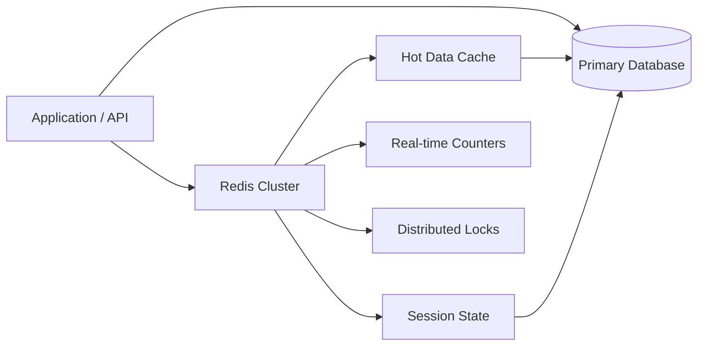

# Redis Cache

## Overview
Redis is an in-memory data structure store used for caching, session management, real-time data processing, and state management. It provides sub-millisecond latency and high throughput for the Google News system.

## Visualization



## Use Cases

### In Google News System
1. **User Profile Cache**: Store user interests, preferences, and recent activity
2. **Feed Caching**: Cache popular feeds to reduce database queries
3. **Article Metadata Cache**: Hot article details and rankings
4. **Session State**: Temporary user session data
5. **Rate Limiting**: Track API requests per user/client
6. **Real-time Counters**: Article view counts, engagement metrics
7. **Distributed Locks**: Coordinate between services (article deduplication)
8. **Pub/Sub Messaging**: Real-time notifications and event broadcasting

## How It Works

### Data Structures & Operations

```
String (Simple key-value)
├─ SET key value EX 3600
├─ GET key
├─ INCR counter
└─ DECR counter

Hash (Structured data)
├─ HSET user:123 name "John" age "30"
├─ HGETALL user:123
└─ HINCRBY user:123 score 100

List (Ordered collection)
├─ LPUSH queue job1 job2
├─ RPOP queue
└─ LRANGE queue 0 -1

Set (Unique collection)
├─ SADD interests:123 news tech sports
├─ SMEMBERS interests:123
└─ SINTER interests:123 interests:456

Sorted Set (Scored collection)
├─ ZADD trending 100 "article1" 95 "article2"
├─ ZRANGE trending 0 10 WITHSCORES
└─ ZINCRBY trending 1 "article1"

HyperLogLog (Approximate counts)
├─ PFADD unique_visitors v1 v2 v3
└─ PFCOUNT unique_visitors

Stream (Event log)
├─ XADD events * field value
└─ XRANGE events - +
```

### Architecture Pattern

```
Application
    ↓
[Cache Layer] Redis Cluster
    ├─ Replica Set 1 (Master + 2 Replicas)
    ├─ Replica Set 2
    └─ Replica Set 3 (Sharding)
    ↓
[Cache Miss] Database/Search Engine
    ↓
[Write-through/Aside Pattern]
Update DB → Update Cache
```

## Configuration Options

### Key Parameters

| Parameter | Description | Recommended Value |
|-----------|-------------|-------------------|
| `maxmemory` | Max memory limit | 64 GB (for news caching) |
| `maxmemory-policy` | Eviction strategy | `allkeys-lru` (least recently used) |
| `timeout` | Client idle timeout | 300 seconds |
| `tcp-backlog` | Connection backlog | 511 |
| `databases` | Number of logical DBs | 16 |
| `save` | RDB persistence | `900 1 300 10` (save if 1 change in 900s) |
| `appendonly` | AOF persistence | `yes` (for durability) |
| `appendfsync` | AOF fsync frequency | `everysec` (balance speed/durability) |

### Cluster Configuration

```
# Redis Cluster Mode
cluster-enabled yes
cluster-node-timeout 15000
cluster-replica-validity-factor 10

# Replication
repl-diskless-sync no
repl-diskless-sync-delay 5

# Lua scripting
lua-time-limit 5000
```

## Effective Use Cases

### Ideal Scenarios
✅ Sub-millisecond latency requirements
✅ Caching hot data (80/20 access patterns)
✅ Session and state management
✅ Real-time counters and leaderboards
✅ Pub/Sub messaging and notifications
✅ Distributed locks and coordination
✅ Rate limiting and throttling
✅ Temporary data (TTL-based expiration)

### Not Suitable For
❌ Large datasets requiring persistence (use databases)
❌ Complex queries or joins (use SQL databases)
❌ Primary data storage (unreliable without proper setup)
❌ Binary large objects (BLOBs)
❌ Strict ACID transactions across multiple keys

## Performance Characteristics

### Speed
- Single-threaded operations: ~100K-1M ops/sec per core
- Pipelined operations: 1M-10M ops/sec per core
- Latency: p50: <1ms, p99: 1-5ms, p999: 10-50ms

### Memory Efficiency
- String key overhead: ~90 bytes per key
- Typical cache hit ratio: 90-99%
- Compression: Built-in (LZ4 for strings)

### Scalability
- Single instance: Up to 64 GB recommended
- Cluster mode: 1000+ nodes, terabytes of data
- Throughput: Scales linearly with nodes in cluster mode

## Integration with Google News System

### User Profile Cache Pattern

```python
import redis
from functools import wraps
import json

redis_client = redis.Redis(
    host='redis-cluster.example.com',
    port=6379,
    db=0,
    decode_responses=True,
    socket_keepalive=True,
    socket_keepalive_options={1: 1, 2: 1, 3: 1}
)

class UserProfileCache:
    USER_PROFILE_TTL = 3600  # 1 hour
    USER_INTERESTS_TTL = 86400  # 1 day
    
    @staticmethod
    def get_user_profile(user_id):
        cache_key = f"profile:{user_id}"
        cached = redis_client.get(cache_key)
        
        if cached:
            return json.loads(cached)
        
        # Cache miss - fetch from DB
        profile = fetch_from_database(user_id)
        redis_client.setex(
            cache_key,
            UserProfileCache.USER_PROFILE_TTL,
            json.dumps(profile)
        )
        return profile
    
    @staticmethod
    def get_user_interests(user_id):
        interests_key = f"interests:{user_id}"
        # Use Redis Set for interests
        interests = redis_client.smembers(interests_key)
        
        if not interests:
            # Load from DB and cache
            interests = fetch_user_interests_from_db(user_id)
            redis_client.sadd(interests_key, *interests)
            redis_client.expire(interests_key, UserProfileCache.USER_INTERESTS_TTL)
        
        return interests
    
    @staticmethod
    def update_interests(user_id, interests):
        interests_key = f"interests:{user_id}"
        redis_client.delete(interests_key)
        redis_client.sadd(interests_key, *interests)
        redis_client.expire(interests_key, UserProfileCache.USER_INTERESTS_TTL)
```

### Feed Caching Pattern

```python
class FeedCache:
    FEED_TTL = 300  # 5 minutes (popular feeds)
    TRENDING_TTL = 60  # 1 minute
    
    @staticmethod
    def cache_user_feed(user_id, feed_data):
        feed_key = f"feed:{user_id}"
        redis_client.setex(
            feed_key,
            FeedCache.FEED_TTL,
            json.dumps(feed_data)
        )
    
    @staticmethod
    def get_user_feed(user_id):
        feed_key = f"feed:{user_id}"
        cached_feed = redis_client.get(feed_key)
        return json.loads(cached_feed) if cached_feed else None
    
    @staticmethod
    def cache_trending_articles():
        # Use Sorted Set for trending with scores
        trending_key = "trending:articles"
        articles = get_trending_articles()
        
        pipe = redis_client.pipeline()
        pipe.delete(trending_key)
        for rank, article in enumerate(articles):
            pipe.zadd(trending_key, {article['id']: -rank})
        pipe.expire(trending_key, FeedCache.TRENDING_TTL)
        pipe.execute()
    
    @staticmethod
    def get_trending(limit=20):
        trending_key = "trending:articles"
        return redis_client.zrange(trending_key, 0, limit-1)
```

### Distributed Lock Pattern

```python
import uuid
import time

class DistributedLock:
    DEFAULT_TIMEOUT = 30
    
    def __init__(self, lock_name, timeout=DEFAULT_TIMEOUT):
        self.lock_name = f"lock:{lock_name}"
        self.timeout = timeout
        self.token = str(uuid.uuid4())
    
    def acquire(self):
        # Use SET NX EX for atomic lock
        return redis_client.set(
            self.lock_name,
            self.token,
            nx=True,
            ex=self.timeout
        )
    
    def release(self):
        # Use Lua script for atomic check-and-delete
        script = """
        if redis.call("get", KEYS[1]) == ARGV[1] then
            return redis.call("del", KEYS[1])
        else
            return 0
        end
        """
        return redis_client.eval(script, 1, self.lock_name, self.token)
    
    def __enter__(self):
        while not self.acquire():
            time.sleep(0.01)
        return self
    
    def __exit__(self, exc_type, exc_val, exc_tb):
        self.release()

# Usage: Article deduplication lock
with DistributedLock("article-dedup"):
    check_and_mark_as_seen(content_hash)
```

### Pub/Sub for Real-time Notifications

```python
class NotificationBroker:
    
    @staticmethod
    def publish_article_event(article_id, event_type):
        channel = f"article:{article_id}"
        message = json.dumps({
            'event': event_type,
            'article_id': article_id,
            'timestamp': time.time()
        })
        redis_client.publish(channel, message)
    
    @staticmethod
    def subscribe_to_article(article_id, callback):
        pubsub = redis_client.pubsub()
        pubsub.subscribe(f"article:{article_id}")
        
        for message in pubsub.listen():
            if message['type'] == 'message':
                callback(json.loads(message['data']))
```

## Persistence & High Availability

### RDB (Redis Database)
- Snapshot-based persistence
- Smaller file size, faster recovery
- Suitable for: Non-critical caches, periodic backups

### AOF (Append-Only File)
- Log-based persistence
- Better durability, larger file size
- Suitable for: Critical data, strict consistency

### Replication
```
Master → Replica 1
      → Replica 2
      → Replica 3
```
- Async replication (fast writes, eventual consistency)
- Failover with Sentinel or Cluster mode

## Operational Considerations

### Scaling Strategy
- Single instance: Up to 64 GB
- Cluster mode: Shard across 3-100+ nodes
- Replication factor: 3 for high availability

### Eviction Policies
| Policy | Behavior | Use Case |
|--------|----------|----------|
| `noeviction` | Return error when full | Important data, sized correctly |
| `allkeys-lru` | Evict least recently used | General caching |
| `allkeys-lfu` | Evict least frequently used | Popularity-based ranking |
| `volatile-ttl` | Evict keys closest to TTL | Mixed data with different importance |

### Monitoring
- Memory utilization and eviction rate
- Hit/miss ratio and throughput
- Connected clients and connection pool
- Replication lag
- Command latency (p50, p99, p999)

## Cost Estimation

For Google News system caching:
- **Redis Cluster**: 6-9 nodes (3 GB each) = $600-900/month
- **Managed Redis (AWS ElastiCache)**: $1,000-1,500/month
- **Storage & backup**: $100/month
- **Monitoring**: $50/month
- **Total**: $750-1,650/month depending on deployment

## Alternatives

| Alternative | Pros | Cons |
|------------|------|------|
| **Memcached** | Simple, lightweight | Limited data types, no persistence |
| **MySQL with InnoDB** | Durable, complex queries | Slower than Redis, more overhead |
| **DynamoDB** | Managed, scalable | Higher latency, cost variance |
| **Aerospike** | Very fast, ACID transactions | More complex, specialized use |

