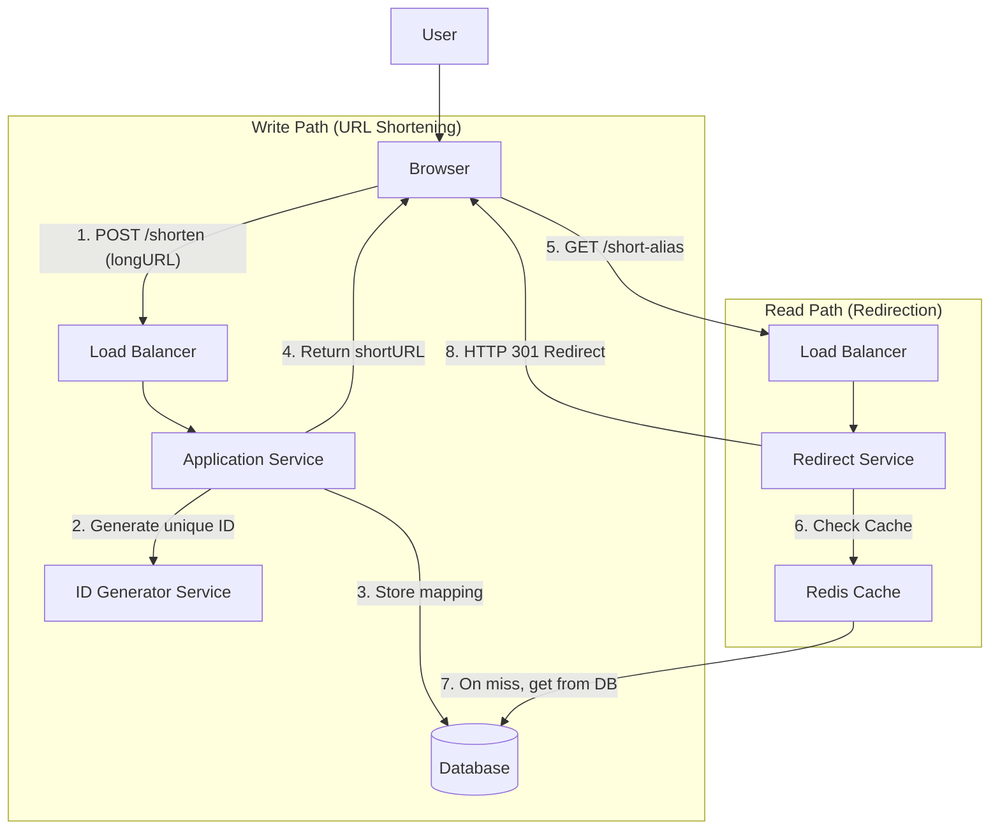

# System Design: URL Shortener (TinyURL)

## 1. Overview

This document outlines the design for a URL shortening service like TinyURL or bit.ly. The service takes a long URL and generates a unique, much shorter alias. When a user accesses the short URL, they are redirected to the original long URL. This is a classic read-heavy system design problem.

## 2. Requirements & Goals

### Functional Requirements
1.  **Shorten URL**: Given a long URL, return a much shorter, unique URL.
2.  **Redirect**: Given a short URL, redirect the user to the original long URL.
3.  **Custom Alias (Optional)**: Allow users to specify a custom short alias.
4.  **Analytics (Optional)**: Track the number of clicks for each short URL.

### Non-Functional Requirements
1.  **High Availability**: The service must be highly available, especially for redirection.
2.  **Low Latency**: Redirections should be extremely fast (e.g., < 100ms).
3.  **Scalability**: The system must handle a high volume of reads (redirections) and a moderate volume of writes (creations).
4.  **Durability**: Once created, a shortened URL should not be lost.
5.  **Uniqueness**: Every long URL should map to a unique short URL.

### Capacity Estimation (Back-of-the-envelope)
-   **Write Traffic (Creations)**: Assume 100 million new URLs per month.
    -   ~40 new URLs/sec (`100M / 30 days / 24h / 3600s`).
-   **Read Traffic (Redirections)**: Assume a 100:1 read-to-write ratio.
    -   ~4,000 redirects/sec on average.
    -   Peaks could be 2-3x higher, so plan for ~10,000 QPS.
-   **Storage**: Assume each URL mapping takes ~500 bytes.
    -   `100M URLs/month * 12 months * 5 years * 500 bytes/URL` = ~3 TB over 5 years. This is manageable for a modern database.

## 3. High-Level Architecture

The system is composed of a write path for creating short links and a highly optimized read path for handling redirects.

!URL Shortener High-Level Architecture

## 4. Low-Level Design

### A. ID Generation Strategy

The core of the service is generating a short, unique key for each URL.

**Strategy 1: Hashing + Collision Resolution**
-   **How**: Hash the long URL (e.g., MD5) and take the first 7 characters.
-   **Pros**: Stateless, deterministic. If two users shorten the same URL, they get the same short URL.
-   **Cons**: Hash collisions are possible. If two different long URLs produce the same hash, we need to append a character or re-hash, which adds complexity.

**Strategy 2: Centralized ID Generator (Snowflake-like)**
-   **How**: A dedicated service generates unique, roughly time-sortable 64-bit IDs. These IDs are then base62-encoded to create a short string.
    -   `Base62`: Uses characters `[a-zA-Z0-9]` (26 + 26 + 10 = 62 chars).
    -   A 64-bit number can be represented in `ceil(log62(2^64))` = ~11 characters, but we only need 7 characters to generate `62^7` (~3.5 trillion) unique IDs.
-   **Pros**: Guaranteed uniqueness, no collisions. IDs are not guessable. Scales well.
-   **Cons**: Requires a separate service, which must be highly available.

We will choose **Strategy 2** as it's more robust and scalable for a large system.

### B. Write Path

1.  The client sends a `POST` request with the `longURL` to the Application Service.
2.  The Application Service first checks if the `longURL` already exists in the database to avoid creating duplicates.
3.  If it's a new URL, the service requests a unique ID from the **ID Generator Service**.
4.  It base62-encodes the unique ID to get the `short_alias` (e.g., `f7Bv3aX`).
5.  The service stores the mapping (`short_alias`, `longURL`) in the database.
6.  It returns the full short URL (e.g., `https://tiny.co/f7Bv3aX`) to the client.

### C. Read Path (Redirection)

This path must be extremely fast.

1.  A user clicks a short link, e.g., `https://tiny.co/f7Bv3aX`.
2.  The request hits the Redirect Service.
3.  The service first checks a distributed cache (like Redis) for the `short_alias` (`f7Bv3aX`).
4.  **Cache Hit**: If the `longURL` is in the cache, the service immediately returns an `HTTP 301 Moved Permanently` redirect response to the browser.
5.  **Cache Miss**:
    a. The service queries the database for the `short_alias`.
    b. If found, it populates the cache with the `longURL` for future requests.
    c. It returns the `HTTP 301` redirect.
    d. If not found in the DB, it returns an `HTTP 404 Not Found`.

## 5. Data Model

A simple key-value model is sufficient. We can use a NoSQL database like DynamoDB or a sharded SQL database.

**URL Mappings Table**
-   `short_alias` (string, Partition Key): The 7-character unique key.
-   `long_url` (string): The original URL.
-   `created_at` (timestamp): For analytics and TTL.
-   `user_id` (string, optional): Who created the link.

**Why NoSQL?**
-   The access pattern is a simple key lookup (`short_alias`).
-   No complex joins or transactions are needed.
-   Horizontal scalability is a primary requirement, which NoSQL databases excel at.

## 6. Scalability and Reliability

### Read Path Scaling
-   **Caching**: A distributed cache (Redis) will absorb the vast majority of read traffic. An LRU (Least Recently Used) eviction policy is suitable.
-   **CDN**: For extremely popular links, the redirect itself can be cached at the CDN layer.
-   **Stateless Service**: The Redirect Service is stateless and can be scaled horizontally behind a load balancer.

### Write Path Scaling
-   **ID Generator**: This service must be highly available. We can run multiple instances and use ZooKeeper for coordination if needed.
-   **Database Sharding**: The database can be sharded by the `hash(short_alias)`. This distributes the write load evenly.

### Availability
-   Replicate the database and cache across multiple availability zones.
-   Separate the read and write paths. An outage in the write service should not affect the critical redirection service.

## 7. Further Considerations

-   **Analytics**: To count clicks, the redirect service can publish an event to a message queue (like Kafka) asynchronously. A separate analytics service can then process these events and update a counter. This keeps the read path fast.
-   **Vanity/Custom URLs**: The write path would check if a custom alias is available in the database. This requires a unique constraint on the `short_alias` column.
-   **Link Expiration**: A background job can periodically scan the database for links past their TTL and delete them.
-   **Security**: Malicious users might link to malware or phishing sites. We can add a service that scans URLs against a blocklist (e.g., Google Safe Browsing API).

## 8. Interview Talking Points

-   **Read-Heavy vs. Write-Heavy**: Emphasize that this is a classic read-heavy system and the architecture is optimized for fast reads.
-   **ID Generation Trade-offs**: Discuss hashing vs. a dedicated ID service. The latter is better for guaranteeing uniqueness at scale.
-   **Database Choice**: Justify using a NoSQL database due to the simple key-value access pattern and need for horizontal scaling.
-   **Caching Strategy**: Explain the multi-layer caching (in-memory, Redis, CDN) to handle the high read QPS.
-   **Separation of Concerns**: Highlight the separation of the read and write paths to ensure the critical redirect functionality remains available even if the shortening service is down.