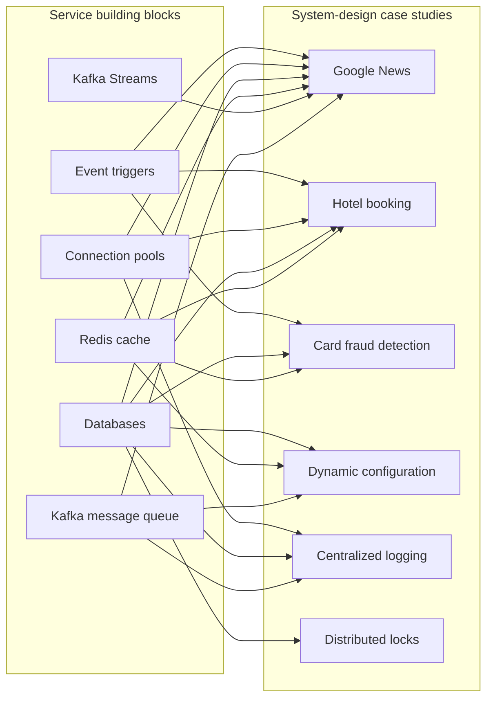
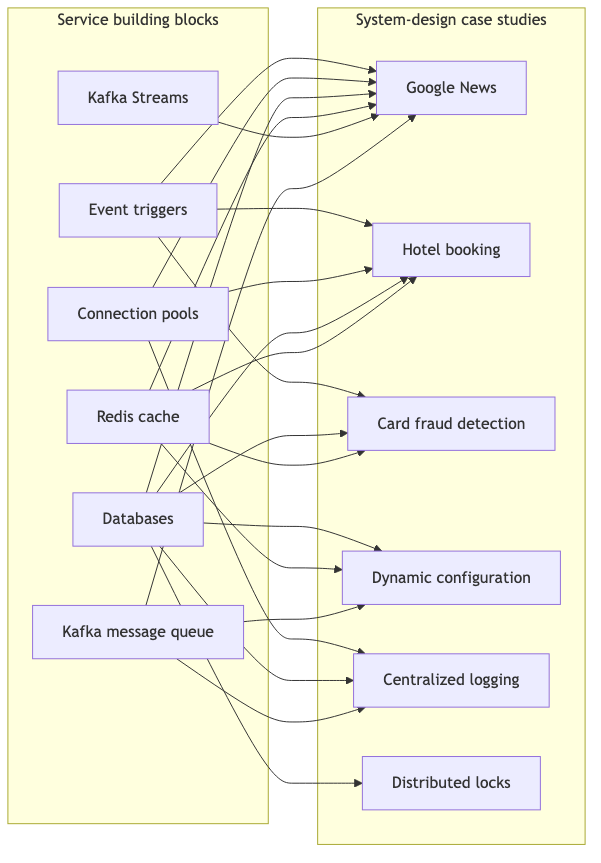

# System Design Visualization Map

This page provides one starting point for the editable Mermaid diagrams embedded
throughout the service guides and system-design case studies. GitHub renders the
diagrams automatically; they remain plain text and can be changed with the docs.

## Service visualizations

- [Services overview — Mermaid source](services/README.md) · [PNG](assets/diagrams/services-README-01.png)
- [Kafka message queue — Mermaid source](services/kafka-message-queue.md) · [PNG](assets/diagrams/services-kafka-message-queue-01.png)
- [Kafka Streams — Mermaid source](services/kafka-streams.md) · [PNG](assets/diagrams/services-kafka-streams-01.png)
- [Redis cache — Mermaid source](services/redis-cache.md) · [PNG](assets/diagrams/services-redis-cache-01.png)
- [Databases — Mermaid source](services/databases.md) · [PNG](assets/diagrams/services-databases-01.png)
- [Connection pool management — Mermaid source](services/connection-pool.md) · [PNG](assets/diagrams/services-connection-pool-01.png)
- [Event-based triggers — Mermaid source](services/event-based-triggers.md) · [PNG 1](assets/diagrams/services-event-based-triggers-01.png) · [PNG 2](assets/diagrams/services-event-based-triggers-02.png)

## System-design visualizations

- [Google News — Mermaid source](google-news-system-design.md) · [PNG](assets/diagrams/google-news-system-design-01.png)
- [Hotel booking — Mermaid source](hotel-booking-system-design.md) · [PNG](assets/diagrams/hotel-booking-system-design-01.png)
- [Fraudulent card detection — Mermaid source](fraudulent-card-detection-design.md) · [PNG](assets/diagrams/fraudulent-card-detection-design-01.png)
- [Dynamic configuration — Mermaid source](dynamic-config-system-design.md) · [PNG 1](assets/diagrams/dynamic-config-system-design-01.png) · [PNG 2](assets/diagrams/dynamic-config-system-design-02.png)
- [Centralized logging — Mermaid source](centralized-logging-system-design.md) · [PNG 1](assets/diagrams/centralized-logging-system-design-01.png) · [PNG 2](assets/diagrams/centralized-logging-system-design-02.png)
- [ZooKeeper distributed lock manager — Mermaid source](distributed-lock-manager-zookeeper.md) · [PNG 1](assets/diagrams/distributed-lock-manager-zookeeper-01.png) · [PNG 2](assets/diagrams/distributed-lock-manager-zookeeper-02.png)
- [Learning roadmap — Mermaid source](learning-roadmap.md) · [PNG](assets/diagrams/learning-roadmap-01.png)
